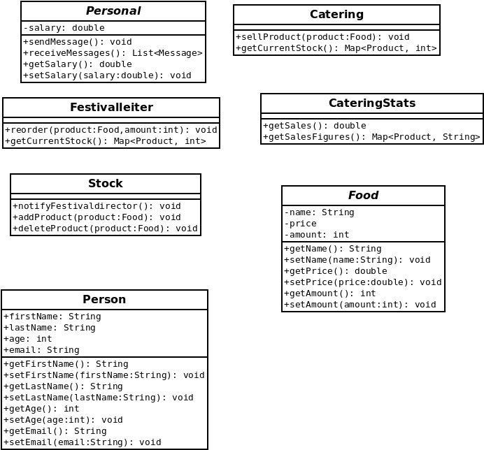
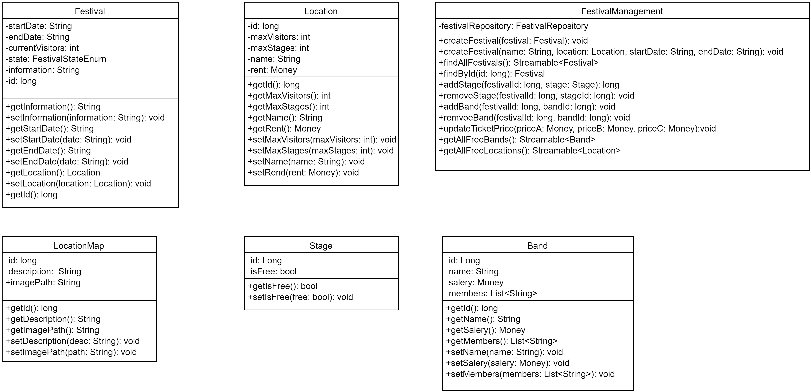
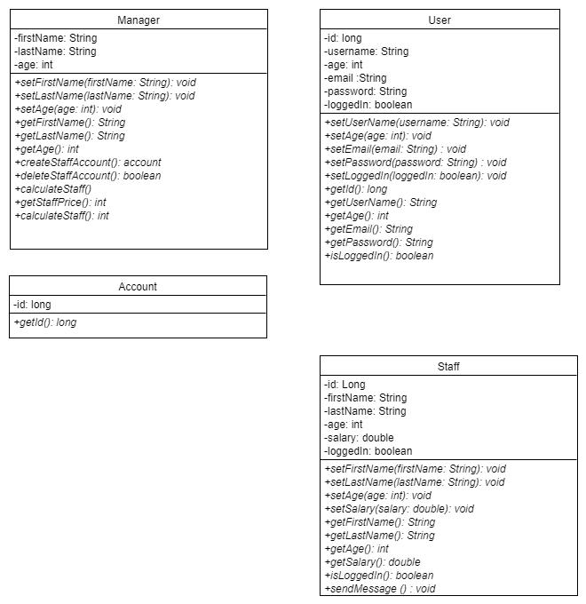
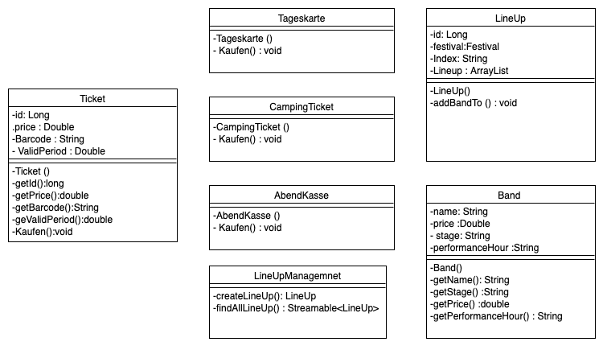

[options="header"]
[cols="1, 3, 3"]
|===
|Version | Bearbeitungsdatum   | Autor 
|...	| ... | ...
|===

= Entwicklerdokumentation

== Einführung und Ziele
* Aufgabenstellung
* Qualitätsziele

== Randbedingungen
* Hardware-Vorgaben
* Software-Vorgaben
* Vorgaben zum Betrieb des Software

== Kontextabgrenzung
* Kontextdiagramm

== Lösungsstrategie
=== Erfüllung der Qualitätsziele
[options="header"]
|=== 
|Qualitätsziel |Lösungsansatz
|... |...
|===

=== Softwarearchitektur
* Beschreibung der Architektur anhand der Top-Level-Architektur oder eines Client-Server-Diagramms

=== Entwurfsentscheidungen
* Verwendete Muster
- Spring MVC: dient zur Strukturierung der Webapplikation
- Singleton: es darf nur einen "Boss" geben

* Persistenz

SalesPoint und Spring übernehmen die Datenbanken zur Datenspeicherung. Beim PersonalManagement und bei der Buchungsverwaltung nutzen wir CrudRepositories. "Spring Data" ist das Modul, das die Komponente  unseres Systems regelt.

* Benutzeroberfläche

Die Benutzeroberfläche wurde mit HTML5, CSS3 und Javascript realisiert. Über ein Navigation bar werden unterschiendliche Komponente des Systems aufgerufen. Die Benutzeroberfläche bietet mithilfe javascript ein sehr benutzerfreundliches und attraktives Interface.

* Verwendung externer Frameworks

iText: wir nutzen iText zur Erstellung von PDF.

[options="header", cols="1,2"]
|===
|Externes Package |Verwendet von (Klasse der eigenen Anwendung)
|salespointframework.useraccount |-authentication.User, authentication.UserController,authentication.UserDatainitializer,authentication.UserManagement
*catering.Catering *festivalDirector.FestivalDirector *PersonalManagement.ManagerDataInitializer
|springframework.util            |*authentication.UserController,authentication.UserDatainitializer,authentication.UserManagement *festival.FesrivalController, festival.FestivalDataInitializer, festival.FestivalManager  *LineUp.LineUpController ,LineUp.LineUpDataInitializer ,LineUp.LineUpManagement *PersonalManagement.ManagerDataInitializer *Ticket.TicketController
|salespointframework.core        |*authentication.UserDatainitializer  *festival.FesrivalDataInitializer *LineUp.LineUpDataInitializer *location.LocationDataInitializer *Ticket.TicketDataInitializer
|springframework.stereotype      |*authentication.UserDatainitializer,authentication.UserManagement *catering.CateringController, catering.CateringManager *festival.FestivalDataInitializer,festival.FesrivalController, festival.FestivalManager *LineUp.LineUpController ,LineUp.LineUpDataInitializer ,LineUp.LineUpManagement *location.LocationController,location.LocationDataInitializer,location.LocationManagement *PersonalManagement.ManagerController,PersonalManagement.ManagerDataInitializer,PersonalManagement.ManagerManagment *Ticket.TicketController,Ticket.TicketDataInitializer
|springframework.transaction     |*authentication.UserManagement  * festival.FestivalManager *LineUp.LineUpManagement *location.LocationManagement
|springframework.data            |*authentication.UserManagement,authentication.UserRepository *catering.CateringRepository *festival.FestivalManager,festival.FestivalRepository *LineUp.LineUpManagement, LineUp.LineUpRepository *location.LocationManagement,location.LocationRepository *PersonalManagement.ManagerRepository *Ticket.TicketRepository
|springframework.web             |*catering.CateringController *festival.FesrivalController  *LineUp.LineUpController *location.LocationController *Ticket.TicketController
|springframework.ui               |*festival.FesrivalController  *LineUp.LineUpController *location.LocationController *Ticket.TicketController
|salespointframework.catalog     |*Food.Food,*Food.FoodCatalog
|springframework.validation     |*location.LocationController
|===

== Bausteinsicht
* Entwurfsklassendiagramme der einzelnen Packages

[options="header"]
|=== 
|Klasse/Enumeration |Description
|...|...
|===

=== Rückverfolgbarkeit zwischen Analyse- und Entwurfsmodell
_Die folgende Tabelle zeigt die Rückverfolgbarkeit zwischen Entwurfs- und Analysemodell. Falls eine Klasse aus einem externen Framework im Entwurfsmodell eine Klasse des Analysemodells ersetzt,
wird die Art der Verwendung dieser externen Klasse in der Spalte *Art der Verwendung* mithilfe der folgenden Begriffe definiert:_

* Inheritance/Interface-Implementation
* Class Attribute
* Method Parameter

[options="header"]
|===
|Klasse/Enumeration (Analysemodell) |Klasse/Enumeration (Entwurfsmodell) |Art der Verwendung
|...|...|...
|===

== Laufzeitsicht
* Darstellung der Komponenteninteraktion anhand eines Sequenzdiagramms, welches die relevantesten Interaktionen darstellt.

== Technische Schulden
* Auflistung der nicht erreichten Quality Gates und der zugehörigen SonarQube Issues zum Zeitpunkt der Abgabe

