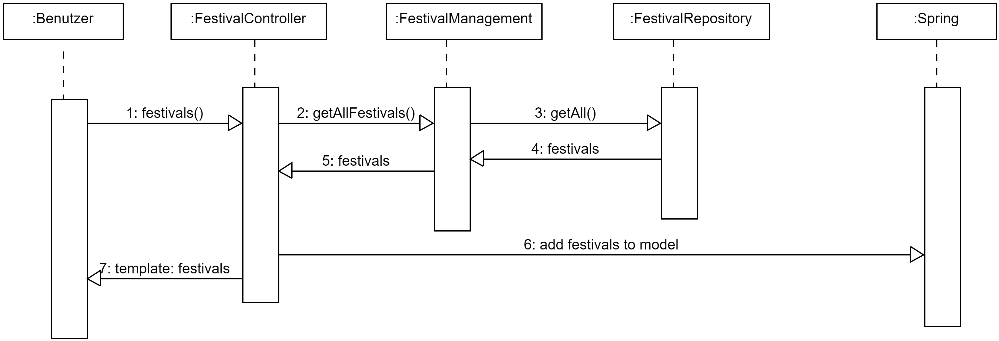
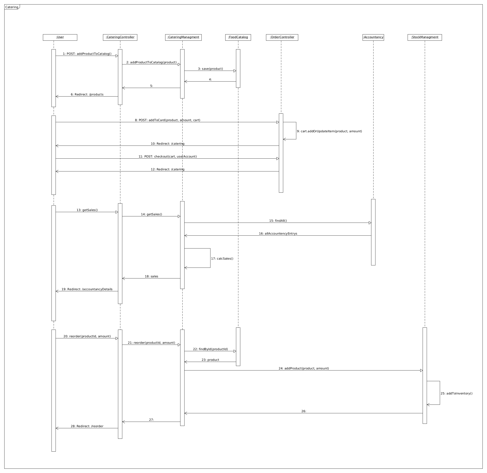
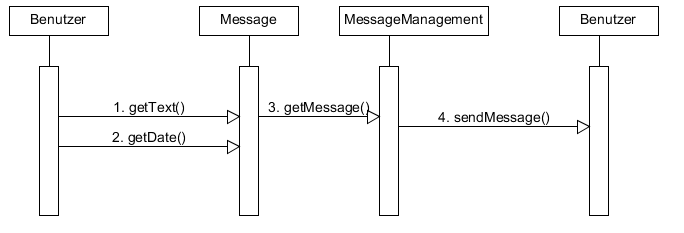
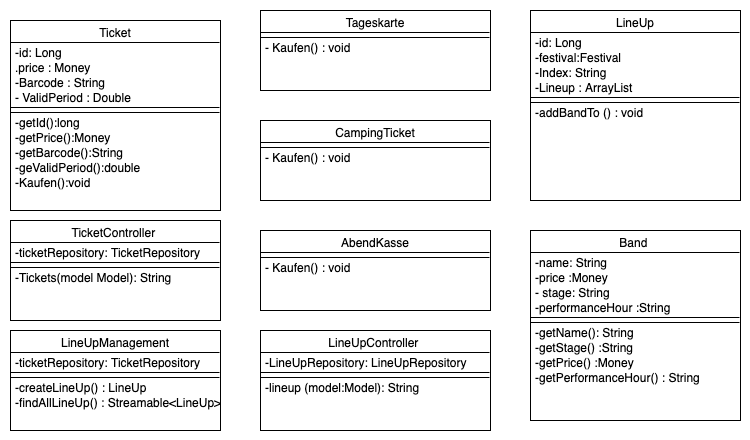

[options="header"]
[cols="1, 3, 3"]
|===
|Version | Bearbeitungsdatum   | Autor 
|...	| ... | ...
|===

= Entwicklerdokumentation

== Einführung und Ziele
* Aufgabenstellung

Der Festivalmanager ist eine Webanwendung, über welche Festivals geplant und verwaltet werden können.

Es sollen Nutzergruppen wie Cateringpersonal, Planungspersonal, Festivalleiter und Manager zugriff auf das System haben um ihren Funktionen zu erfüllen.

Das Cateringpersonal soll ein eigenes Terminal erhalten über welches sie Essen und Trinken abrechnen können.

Das Planungspersonal kann Festivals erstellen. Dazu gibt es eine Location und Terminal Auswahl, sowie die Möglichkeit Bands zu buchen.
Zusätzlich gibt es die Möglichkeit die Location zu planen und Cateringstände, Toiletten und Bühnen zu platzieren.

Der Festivalleiter hat ein Terminal in dem er die aktuellen Statistiken über das Festival sieht. Er hat zudem die Fähigkeit Lagerbestände aufzufrischen.

Es gibt ein Ticketsystem, welches Online und vor Ort benutzt wird. Dieses stellt Tickets nach einem Kauf aus und kann diese verifizieren.

Der Manager kann betriebswirtschaftliche Daten abrufen sowie angemeldete Mitarbeiter sehen.

Die Planungsabteilung soll Termine und Locations festlegen könnnen. Somit brauchen sie eine Vorauswahl sowie die Möglichkeit diese Auswahl zu erweitern beziehungsweise zu ändern.
Die Terminvergabe muss abgestimmt sein, sodass keine Doppeltbuchung möglich ist. Da jede Location nur bestimmt viel Platz hat muss sichergestellt werden das es nur eine bestimmte Anzahl an Tickets
gibt. In Verbindung dazu müssen pro 100 Personem mindestens eine Person des Sicherheitspersonals anwesend sein. Dies muss in der Planung berrücksichtig und durch das System sichergestellt werden.
Um den Besuchern einen angenehmen Aufenthalt zu ermöglichen soll das Planungsteam in der Lage sein Toiletten sowie Cateringstände platzieren zu können.
Ein weiter Teil der Planung besteht darin Angebote von Künstlern einzuholen, welche durch eine Vorauswahl, die bearbeitet werden kann, ermöglicht wird.

Das Cateringpersonal hat eigene Terminals, welche mit dem Lagersystem interagieren. Dies geschieht indem das Cateringpersonal Essen bzw. Getränke zu einer Abrechnung hinzufügen und diese dann,
nach Kundenbestätigung, abschicken.

Das Management hat ein eigenes Terminal in welchem Diagramme und Statisiken über die betriebswirtschaftlichen Daten des Festivals zu sehen sind. Desweiternen hat dieses eine Übersicht über alle angemeldeten Mitarbeiter. Diese Mitarbeiter können durch das Management erstellt und verwaltet werden. Der Manager ist dafür zuständig das Festival zu erstellen.

Der Festivalmanager hat eine Übersicht über Nachrichten bezüglich des Festivals sowie eine Übersicht über den Lagerberstand. Außerdem kann dieser Nachbestellungen tätigen.
In dieser Übersicht sind auch aktuelle Zahlen zu Besucherzahlen sowie Verkaufszahlen des Caterings sowie Informationen zur aktuellen Bühnenbelegung.

Die Ticketverkäufer vor Ort haben ein eigenes Terminal, in dem sie Tickets für die Abendkasse verkaufen könnnen. Damit nicht zu viele Personen auf dem Festival sind gibt es eine
automatische Beschränkung. Desweiteren sind Ticketverkäufer in der Lage Tickets am Einlass zu validieren. Dafür gibt es eine Datenbank, die die Bestellungen speichert und validieren kann.

* Qualitätsziele

Die folgende Tabelle zeigt, welche Qualitätsansprüche in welchem Umfang erfüllt werden müssen. Die erste Spalte listet die Qualitätsanforderungen auf, während in den folgenden Spalten ein "x" zur Kennzeichnung der Priorität verwendet wird.

Instandhaltung::
Represäntiert den Grad, wie Effektiv Änderungen und Reperaturen vorgenommen werden können.

Erweiterbarkeit::
Gibt den Grad an, wie einfach es sein soll, später änderungen um Code vorzunehmen um z.B. weitere Funktionen einzubinden. Dies wird etwa durch allgemeine Bezeichnungen der Variablen und Funktionen erreicht

Benutzerfreundlichkeit::
Gibt an, wie einfach und übersichtlich die Bedienung des Systems ist. Sodass auch Laien ohne Probleme das System bedienen können.

Sicherheit::
Bis zu welchem Grad die Sicherheit der Benutzer und ihrer Daten sowie aller anderen im System gespeicherten Daten sicher sind und von Unbefugten nicht eingesehen werden können.

1 = nicht wichtig --- 5 = sehr wichtig
[options="header", cols="3h, ^1, ^1, ^1, ^1, ^1"]
|===
|Qualitätsziel             | 1 | 2 | 3 | 4 | 5
|Instandhaltung            |   |   |   | x |
|Erweiterbarkeit           |   |   |   | x |
|Benutzer Feundlichkeit    |   |   |   |   | x
|Sicherheit                |   |   |   | x |
|===

== Randbedingungen
=== Hardware-Vorgaben
* Die Hardware, die verwendet werden könnte, muss nicht erstklassig sein, um das in der Software implementierte System auszuführen.

=== Software-Vorgaben

== Java

* Java 8 SRE zum Asuführen
* Java 8 SDK zum Kompilieren

== Browser

* Google Chrome , Version 69.0+

* Mozila Firefox , Version 63.0+

== Maven 3 zur Regelung der Dependencies 

=== Vorgaben zum Betrieb des Software

* Die Software muss fertig sein und auch keine Probleme im Code haben, um problemlos ausgeführt zu werden.
Man kann die Software vom Terminal seines Computers oder vom Terminal seiner jeweiligen IDE ausführen, man kann die Software sehen, indem man in den Browser von Mozila Firefox oder Google Chrome die URL eingibt: http://localhost:8080/

== Lösungsstrategie
=== Erfüllung der Qualitätsziele
[options="header"]
|=== 
|Qualitätsziel |Lösungsansatz
|Instandhaltung a| * Gute Dokumentation
|Erweiterbarkeit a| * Gute Dokumentation
* Modularität
|Benutzerfreundlichkeit a| * Einheitliches GUI-Design
* Erwatungskonform sein -> Warenkorb oben rechts, Navigations oben mitte, Logo oben links
* Intuitive Navigation -> Reiter erscheinen je nach Rolle
* Multi-Lingual (Deutsch, Englisch) -> erweiterbar
* Ladezeiten möglichst gering halten
* Den Benutzer nicht mit Informationen überladen
|Sicherheit a| * Benutzen von SalespointSecurityConfiguration um Routen zu sichern und Nutzern ohne entsprechene Rolle keine Zugriff auf die entsprechenden Routen zu gewähren
|===

=== Softwarearchitektur

=== Entwurfsentscheidungen
* Verwendete Muster
- Spring MVC: dient zur Strukturierung der Webapplikation
- Singleton: es darf nur einen "Boss" geben

* Persistenz

SalesPoint und Spring übernehmen die Datenbanken zur Datenspeicherung. Beim PersonalManagement und bei der Buchungsverwaltung nutzen wir CrudRepositories. "Spring Data" ist das Modul, das die Komponente  unseres Systems regelt.

* Benutzeroberfläche

Die Benutzeroberfläche wurde mit HTML5, CSS3 und Javascript realisiert. Über ein Navigation bar werden unterschiendliche Komponente des Systems aufgerufen. Die Benutzeroberfläche bietet mithilfe javascript ein sehr benutzerfreundliches und attraktives Interface.

* Verwendung externer Frameworks

iText: wir nutzen iText zur Erstellung von PDF.

[options="header", cols="1,2"]
|===
|Externes Package |Verwendet von (Klasse der eigenen Anwendung)
|salespointframework.useraccount |authentication.User, authentication.UserController,authentication.UserDatainitializer,authentication.UserManagement,catering.Catering ,festivalDirector.FestivalDirector ,PersonalManagement.ManagerDataInitializer
|springframework.util            |authentication.UserController,authentication.UserDatainitializer,authentication.UserManagement ,festival.FesrivalController, festival.FestivalDataInitializer, festival.FestivalManager  ,LineUp.LineUpController ,LineUp.LineUpDataInitializer ,LineUp.LineUpManagement ,PersonalManagement.ManagerDataInitializer ,Ticket.TicketController
|salespointframework.core        |authentication.UserDatainitializer ,festival.FesrivalDataInitializer ,LineUp.LineUpDataInitializer ,location.LocationDataInitializer ,Ticket.TicketDataInitializer
|springframework.stereotype      |authentication.UserDatainitializer,authentication.UserManagement,catering.CateringController, catering.CateringManager , festival.FestivalDataInitializer,festival.FesrivalController, festival.FestivalManager , LineUp.LineUpController ,LineUp.LineUpDataInitializer ,LineUp.LineUpManagement ,location.LocationController,location.LocationDataInitializer,location.LocationManagement, PersonalManagement.ManagerController,PersonalManagement.ManagerDataInitializer,PersonalManagement.ManagerManagment, Ticket.TicketController,Ticket.TicketDataInitializer
|springframework.transaction     |authentication.UserManagement, festival.FestivalManager ,LineUp.LineUpManagement ,location.LocationManagement
|springframework.data            |authentication.UserManagement,authentication.UserRepository ,catering.CateringRepository ,festival.FestivalManager,festival.FestivalRepository ,LineUp.LineUpManagement, LineUp.LineUpRepository ,location.LocationManagement,location.LocationRepository ,PersonalManagement.ManagerRepository ,Ticket.TicketRepository
|springframework.web             |catering.CateringController ,festival.FesrivalController  ,LineUp.LineUpController ,location.LocationController ,Ticket.TicketController
|springframework.ui               |festival.FesrivalController  ,LineUp.LineUpController ,location.LocationController ,Ticket.TicketController
|salespointframework.catalog     |Food.Food,Food.FoodCatalog
|springframework.validation     |location.LocationController
|===

== Bausteinsicht
* Catering and Stock

* Festival

* Location

* LineUp

image::models/design/package_lineup.png[]

* Ticket

* Manager and User

image::models/design/ManUsClasses.png[]

[options="header"]
|=== 
|Klasse/Enumeration |Description
|Person|abstrakte Klasse welche die Eigenschaften einer Person wiederspiegelt (z.B. Alter)
|Personal|abstrakte Klasse welche die Eigenschaften des Festival Personals beschreibt (z.B. dass das Personal ein Gehalt bekommt)
|Festivalleiter|ist eine spezifische Ausprägung von Personal und ist für die Administration des Fesitvals zuständig
|Catering|ist eine spezifische Ausprägung von Personal und ist für den Verkauf von Catering Produkten (Food) zuständig / arbeitet am Catering Schalter
|CateringController|ist zur bearbeitung("empfang") der HTTP Request bezüglich Catering angelegenheiten zuständig
|CateringManagment|ist zur verarbeitung der vom CateringController übergebene Daten aus der HTTP Request zuständig (steht in Verbindung mit FoodCatalog bzw. der DB)
|FoodCatalog|ist ein Interface welches vom Salespoint Catalog erbt und worüber man den Food Katalog bearbeiten kann (d.h. welche Produkte im Catering angeboten werden)
|StockController|ist zur bearbeitung("empfang") der HTTP Request bezüglich Stock angelegenheiten zuständig
|StockManager|ist zur verarbeitung der vom StockController übergebene Daten aus der HTTP Request zuständig (steht in Verbindung mit einem UniqueInventory bzw. der DB)
|UniqueInventory|ist die Schnittstelle womit man das Lager bearbeiten kann
|Ticket |abstrakte Klasse welche die Attribute und Eigenschaften von den Arten von Tickets hat ( z.B. Preis)
|CampingTicket, Abendkasse, Tageskarte | sind Klassen , die die Eigenschaften von der Klasse Ticket erweitern
|TicketController| ist die Klasse, die steuert, wann ein Kunde ein Ticket kauft und es direkt aus dem Repository entfernt
|LineUp|ist eine Klasse , die direkt verbunden mit der Klasse Festival ist, und hilft um zu sehen, wann und welche Banden in einer bestimmten Festival spielen werden. Diese Klasse ist eine List von Banden
|Band | ist die Klasse , die die Eigenschaften für die Personen und die Gruppen für ein bestimmtes LineUp einer Festival gibt.
|LineUpController|ist zur bearbeitung("empfang") der HTTP Request bezüglich LineUp angelegenheiten zuständig
|LineUpManagement |ist die Klasse , die für ein oder mehrere Festivals ein bestimmtes LineUp organisiert

|===

=== Rückverfolgbarkeit zwischen Analyse- und Entwurfsmodell
_Die folgende Tabelle zeigt die Rückverfolgbarkeit zwischen Entwurfs- und Analysemodell. Falls eine Klasse aus einem externen Framework im Entwurfsmodell eine Klasse des Analysemodells ersetzt,
wird die Art der Verwendung dieser externen Klasse in der Spalte *Art der Verwendung* mithilfe der folgenden Begriffe definiert:_

* Inheritance/Interface-Implementation
* Class Attribute
* Method Parameter

[options="header"]
|===
|Klasse/Enumeration (Analysemodell) |Klasse/Enumeration (Entwurfsmodell) |Art der Verwendung
|CateringStats|CateringManagment|zum bearbeiten jeglicher Aktionen die mit Catering zutun haben
|===

== Laufzeitsicht

=== Festival

image::models/design/createFestival.png[]

Der Benutzer kann ein neues Festival erstellen.

Der Benutzer kann alle Festivals anzeigen.

=== Location

image::models/design/listAllLocations.png[]

=== Manager

=== Stock

Der Festivalleiter und Catering kann den aktuellen Lagerbestand einsehen.

=== Catering

Produkte zum Katalog hinzufügen, Produkte zum Warenkorb hinzufügen, Umsatz einsehen, Verkaufszahlen einsehen.

=== Ticket

=== LineUp

image::models/design/LineUpSD.png[]

=== PersonalMessageManagement

image::models/design/PersonalMessageManagement_SD_2.png[]

image::models/design/PersonalMessageManagement_SD_3.png[]

== Technische Schulden
* Auflistung der nicht erreichten Quality Gates und der zugehörigen SonarQube Issues zum Zeitpunkt der Abgabe

== Klassen

image::models/design/catering_inventory_extended.png[]

image::models/design/ManUs.png[]

