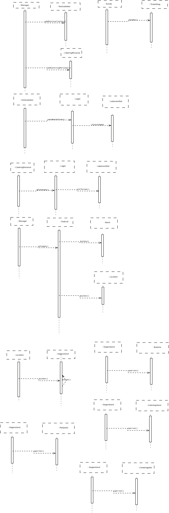
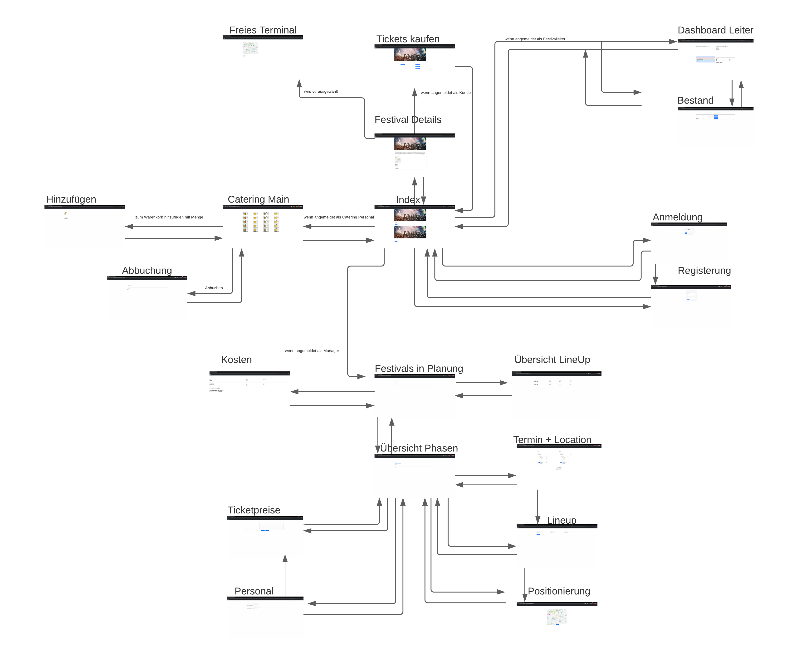

= Pflichtenheft
:project_name: Festivalmanager
== __{project_name}__

[options="header"]
[cols="1, 1, 1, 1, 4"]
|===
|Version | Status      | Bearbeitungsdatum   | Autoren(en) |  Vermerk
|0.1     | In Arbeit   | 27.10.2021          | Autor       | Initiale Version
|===

== Inhaltsverzeichnis

* <<_inhaltsverzeichnis>>

* <<_zusammenfassung>>

* <<_aufgabenstellung_und_zielsetzung>>

* <<_produktnutzung>>

* <<_interessengruppen>>

* <<_systemgrenze>>

** <<_kontextdiagramm>>

** <<_top_level_arch>>

* <<_anwendungsfälle>>

** <<_akteure>>

** <<_überblick>>

** <<_anwendungsfallbeschreibung>>

* <<_funktionale_anforderungen>>

** <<_muss_kriterien>>

** <<_kann_kriterien>>

* <<_nicht_funktionale_anforderungen>>

** <<_qualitätsziele>>

** <<_nicht_funktioanle_anforderungen>>

* <<_gui_prototyp>>

** <<_dialoglandkarte>>

** <<_dialogbeschreibung>>

* <<_datenmodell>>

** <<_klassendiagramm>>

** <<_klassen_und_enummerationen>>

* <<_akzeptanztestfälle>>

* <<_glossar>>

* <<_offene_punkte>>

== Zusammenfassung
Eine kurze Beschreibung des Dokuments. Wenige Absätze.

== Aufgabenstellung und Zielsetzung
Text aus Aufgabenstellung kopieren und ggfs. präzisieren.
Insbesondere ergänzen, welche Ziele mit dem Abschluss des Projektes erreicht werden sollen.

== Produktnutzung
In welchem Kontext soll das System später genutzt werden? Welche Rahmenbedingungen gelten?
Zusätzlich kurze Einleitung für fachfremde Personen

[[_interessengruppen]]
== Interessensgruppen (Stakeholders)
Welche realen und juristischen Personen(-gruppen) haben Einfluss auf die Anforderungen im Projekt?

[[_systemgrenze]]
== Systemgrenze und Top-Level-Architektur

=== Kontextdiagramm

image::models/analysis/contextDiagram.png[]

[[_top_level_arch]]
=== Top-Level-Architektur

image::models/analysis/topLevelDiagram.png[]

== Anwendungsfälle

=== Akteure

Akteure sind die Benutzer des Software-Systems oder Nachbarsysteme, welche darauf zugreifen. Dokumentieren Sie die Akteure in einer Tabelle. Diese Tabelle gibt einen Überblick über die Akteure und beschreibt sie kurz. Die Tabelle hat also mindestens zwei Spalten (Akteur Name und Kommentar).
Weitere relevante Spalten können bei Bedarf ergänzt werden.

// See http://asciidoctor.org/docs/user-manual/#tables
[options="header"]
[cols="1,4"]
|===
|Name |Beschreibung
|Benutzer  a| * repräsentiert jede Person die mit dem System interagiert, unabhängig ob diese authentifiziert ist oder nicht
|Registrierter Benutzer / Authentifizierter Benutzer a|  * repräsentiert jede Person die einen Account hat, authentifiziert ist und mit dem System interagiert
|nicht-authentifizierter Benutzer a| * repräsentiert jede Person die nicht authentifiziert ist und somit nicht mit dem System interagieren kann (also Beobachter sind)
|Kunde a| * repräsentiert jede Person ohne “spezielle” Rolle (wie z.B. Catering, Festivalleiter, …), die einen Account besitzt und authentifiziert ist 
* kann Karten kaufen
|Festivalleiter a| * jeder registrierte Benutzer mit der Rolle “Festivalleiter
* ist für die Administration (nachbestellungen tätigen, Lagerbestände beobachten und Mitarbeiter anweisen) zuständig
| Catering a| * repräsentiert jede Person mit der Rolle “Catering”
* hat zugriff auf den extra Reiter “Catering”
* kann Abrechnungen tätigen (Essen, Trinken)
| Manager a| * repräsentiert jede Person mit der Rolle “Manager”
* ist für die Verteilung der Nutzeraccount des Personals verantwortlich
* hat Überblick über betriebswirtschaftliche Daten und Mitarbeiter im System

|===

[[_überblick]]
=== Überblick Anwendungsfalldiagramm

image::models/analysis/useCaseDiagram.png[]

[[_anwendungsfallbeschreibung]]
=== Anwendungsfallbeschreibungen
Dieser Unterabschnitt beschreibt die Anwendungsfälle. In dieser Beschreibung müssen noch nicht alle Sonderfälle und Varianten berücksichtigt werden. Schwerpunkt ist es, die wichtigsten Anwendungsfälle des Systems zu finden. Wichtig sind solche Anwendungsfälle, die für den Auftraggeber, den Nutzer den größten Nutzen bringen.
Für komplexere Anwendungsfälle ein UML-Sequenzdiagramm ergänzen.
Einfache Anwendungsfälle mit einem Absatz beschreiben.
Die typischen Anwendungsfälle (Anlegen, Ändern, Löschen) können zu einem einzigen zusammengefasst werden.

Sequenzdiagramme:

== Funktionale Anforderungen

=== Muss-Kriterien
Was das zu erstellende Programm auf alle Fälle leisten muss.

=== Kann-Kriterien
Anforderungen die das Programm leisten können soll, aber für den korrekten Betrieb entbehrlich sind.

[[_nicht_funktionale_anforderungen]]
== Nicht-Funktionale Anforderungen

=== Qualitätsziele

Dokumentieren Sie in einer Tabelle die Qualitätsziele, welche das System erreichen soll, sowie deren Priorität.

[[_nicht_funktioanle_anforderungen]]
=== Konkrete Nicht-Funktionale Anforderungen

Beschreiben Sie Nicht-Funktionale Anforderungen, welche dazu dienen, die zuvor definierten Qualitätsziele zu erreichen.
Achten Sie darauf, dass deren Erfüllung (mindestens theoretisch) messbar sein muss.

== GUI Prototyp

image::models/analysis/images/uebergang/index.png[]

Index

image::models/analysis/images/uebergang/login_login.png[]

Login

image::models/analysis/images/uebergang/login_register.png[]

Register

image::models/analysis/images/uebergang/festival_buy.png[]

Festival Tickets kaufen

image::models/analysis/images/uebergang/festival_festival.png[]

Festival Details

image::models/analysis/images/uebergang/planning_addlineup.png[]

Line Up hinzufügen / Ändern

image::models/analysis/images/uebergang/planning_costs.png[]

Kosten während der Planung

image::models/analysis/images/uebergang/planning_editstaff.png[]

Personalbelegung ändern

image::models/analysis/images/uebergang/planning_festivals.png[]

Liste aktueller Festivals

image::models/analysis/images/uebergang/planning_lineup.png[]

Line Up in Tabellenformat

image::models/analysis/images/uebergang/planning_main.png[]

Übersicht und Verlinkung der einzelnen Planungsphasen

image::models/analysis/images/uebergang/planning_phase1.png[]

Termin- und Locationauswahl

image::models/analysis/images/uebergang/planning_positionierung.png[]

Positionierung der einzelnen Bereiche mit Lageplan

image::models/analysis/images/uebergang/planning_ticketprice.png[]

Ticketpreise ändern

image::models/analysis/images/uebergang/terminal_catering_main.png[]

Hauptterminal des Cateringpersonals

image::models/analysis/images/uebergang/terminal_catering_buy.png[]

Hinzufügen eines Artikels (Essen/Trinke) mit Menge

image::models/analysis/images/uebergang/terminal_catering_checkout.png[]

Abrechnung/Abbuchung einer Bestellung

image::models/analysis/images/uebergang/terminal_director_stock.png[]

Lagerbestandsübersicht des Festivalleiters

image::models/analysis/images/uebergang/terminal_director_dashboard.png[]

Übersicht über den Umsatz, Nachrichten, aktuelle Bühnenbelegung und die aktuellen Besucherzahlen

image::models/analysis/images/uebergang/terminal_free_free.png[]

Freies Terminal mit Lageplan und Lineup

image::models/analysis/images/uebergang/terminal_manager_main.png[]

Übersicht des Managers über Mitarbeiter und die Finanzen

Übergangsdiagramm

[[_dialoglandkarte]]
=== Überblick: Dialoglandkarte
Erstellen Sie ein Übersichtsdiagramm, das das Zusammenspiel Ihrer Masken zur Laufzeit darstellt. Also mit welchen Aktionen zwischen den Masken navigiert wird.
//Die nachfolgende Abbildung zeigt eine an die Pinnwand gezeichnete Dialoglandkarte. Ihre Karte sollte zusätzlich die Buttons/Funktionen darstellen, mit deren Hilfe Sie zwischen den Masken navigieren.

=== Dialogbeschreibung
Für jeden Dialog:

1. Kurze textuelle Dialogbeschreibung eingefügt: Was soll der jeweilige Dialog? Was kann man damit tun? Überblick?
2. Maskenentwürfe (Screenshot, Mockup)
3. Maskenelemente (Ein/Ausgabefelder, Aktionen wie Buttons, Listen, …)
4. Evtl. Maskendetails, spezielle Widgets

== Datenmodell

[[_klassendiagramm]]
=== Überblick: Klassendiagramm

image::models/analysis/klassenDiagram.png[]

=== Klassen und Enumerationen
Dieser Abschnitt stellt eine Vereinigung von Glossar und der Beschreibung von Klassen/Enumerationen dar. Jede Klasse und Enumeration wird in Form eines Glossars textuell beschrieben. Zusätzlich werden eventuellen Konsistenz- und Formatierungsregeln aufgeführt.

// See http://asciidoctor.org/docs/user-manual/#tables
[options="header"]
|===
|Klasse/Enumeration |Beschreibung |
|…                  |…            |
|===

== Akzeptanztestfälle

:Pre: Vorraussetzung(en)
:Event: Ereignis
:Result: Erwartetes Ergebnis

[cols="1h, 4"]
|===
|ID            |<<AT0001>>
|Use Case      |<<UC0001>>
|{Pre}        a|Es existiert ein Benutzer (Hans, 123) im System
|{Event}      a|Ein vorhandener Benutzer geht auf die Login-Seite, gibt seine Daten ein (Hans, 123) und drückt "Anmelden"
|{Result}     a|
- Der Benutzer ist nun als Hans authentifiziert
- Je nach Benutzergruppe (Customer, Boss, Catering, ...) werden ihm entsprechende Reiter angezeigt
- Der Benutzer wird auf die Startseite weitergeleitet, wo im rechts oben sein Name angezeigt wird
- Der Benutzer hat nun die Berechtigungen Dinge der Benutzergruppe "Custome" zu tun, wie zum Beispiel Tickets kaufen
|===

[cols="1h, 4"]
|===
|ID            |<<AT0002>>
|Use Case      |<<UC0001>>
|{Pre}        a|Der Benutzer "Hans" ist noch nicht im System enthalten
|{Event}      a|Ein Benutzer geht auf die Registrierungsseite und füllt das Registrieungsformular aus (Hans, 123) und drückt "Registriern"
|{Result}     a|
- Es wird der Benutzer "Hans" hinzugefügt
- Der Benutzer ist nun als "Hans" authentifiziert
- Der Benutzer wird auf die Startseite weitergeleitet, wo im rechts oben sein Name angezeigt wird
- Der Benutzer hat nun die Berechtigungen Dinge der Benutzergruppe "Custome" zu tun, wie zum Beispiel Tickets kaufen
|===

[cols="1h, 4"]
|===
|ID            |<<AT0003>>
|Use Case      |<<UC0001>>
|{Pre}        a|Es ist ein Benutzer im System angemeldet
|{Event}      a|Der Benutzer drückt auf "Abmelden"
|{Result}     a|
- Der Benutzer ist nun abgemeldet und nicht mehr authentifiziert
- Der Benutzer kann nur noch die Festivals anschauen und sich anmelden / registrieren
|===

[cols="1h, 4"]
|===
|ID            |<<AT0004>>
|Use Case      |<<UC0001>>
|{Pre}        a|Ein Benutzer ist nicht angemeldet, der Benutzer (Hans, 123) existiert schon
|{Event}      a|Ein Benutzer geht auf die Registrierungsseite und füllt das Registrieungsformular aus (Hans, 123) und drückt "Registriern"
|{Result}     a|
- Eine Fehlermeldung wird angezeigt um dem Benutzer zu signalisieren, dass der Benutzer (Hans) schon existiert
|===

[cols="1h, 4"]
|===
|ID            |<<AT0005>>
|Use Case      |<<UC0002>>
|{Pre}        a|Der Benutzer ist als Catering Personal angemeldet, Cola-Vorrat: 100x
|{Event}      a|Der Benutzer drückt Cola
|{Result}     a|
- Der Benutzer wird auf die Seite von "Cola" weitergeleitet
|===

[cols="1h, 4"]
|===
|ID            |<<AT0006>>
|Use Case      |<<UC0002>>
|{Pre}        a|Der Benutzer ist als Catering Personal angemeldet und hat auf "Cola" gedrückt
|{Event}      a|Der Benutzer gibt die Anzahl ein (5) und bestätigt
|{Result}     a|
- 5x Cola wird dem Wahrenkorb hinzugefügt
- Der Benutzer wird auf die Catering-Hauptseite weitergeleitet
|===

[cols="1h, 4"]
|===
|ID            |<<AT0006>>
|Use Case      |<<UC0002>>
|{Pre}        a|Der Benutzer ist als Catering Personal angemeldet und hat auf "Cola" gedrückt, Cola Vorrat ist bei 4x
|{Event}      a|Der Benutzer gibt die Anzahl ein (5) und bestätigt
|{Result}     a|
- Fehlermeldung wird angezeigt: Cola Vorrat bei 4 - Bestellt 5
- Der Benutzer wird auf die Catering-Hauptseite weitergeleitet
|===

[cols="1h, 4"]
|===
|ID            |<<AT0006>>
|Use Case      |<<UC0002>>
|{Pre}        a|Der Benutzer ist als Catering Personal angemeldet und hat auf "Cola" gedrückt, Cola Vorrat ist bei 4x
|{Event}      a|Der Benutzer gibt die Anzahl ein (5) und bestätigt
|{Result}     a|
- Fehlermeldung wird angezeigt: Cola Vorrat bei 4 - Bestellt 5
- Der Benutzer wird auf die Catering-Hauptseite weitergeleitet
|===

[cols="1h, 4"]
|===
|ID            |<<AT0007>>
|Use Case      |<<UC0002>>
|{Pre}        a|Der Benutzer ist als Catering Personal angemeldet
|{Event}      a|Der Benutzer drückt auf "Abrechnen"
|{Result}     a|
- Der Benutzer wird auf die Catering-Abrechnungsseite weitergeleitet
|===

[cols="1h, 4"]
|===
|ID            |<<AT0008>>
|Use Case      |<<UC0002>>
|{Pre}        a|Der Benutzer ist als Catering Personal angemeldet und befindet sich auf der Abrechnungsseite
|{Event}      a|Der Kunde hat bezahlt und der Benutzer drückt auf "Abrechnen"
|{Result}     a|
- Der Wahrenkorbinhalt wird vom Lager abgezogen
- Der Benutzer wird auf die Catering-Hauptseite weitergeleitet
|===

[cols="1h, 4"]
|===
|ID            |<<AT0009>>
|Use Case      |<<UC0003>>
|{Pre}        a|Für Cola wurde im Lagersystem eine Mindesgrenze von 50 gesetzt
|{Event}      a|Ein Benutzer des Cateringpersonals rechnet 3 Colas ab und der Bestand von Cola fällt unter 50
|{Result}     a|
- Der Festivalleiter bekommt eine Nachricht, dass der Mindesbestand von Cola unterschritten wurde
|===

[cols="1h, 4"]
|===
|ID            |<<AT0010>>
|Use Case      |<<UC0003>>
|{Pre}        a|Ein Benutzer ist als Festivalleiter angemeldet und ist auf seiner Nachbestellseite
|{Event}      a|Der Benutzer gibt bei "Cola" einen Nachbestellwert von 300 ein und drückt auf "Nachbestellen"
|{Result}     a|
- Es wird 300 x Cola nachbestellt (Lagerstand erhöht sich um 300)
- Der Benutzer wird auf die Nachbestellseite weitergeleitet
|===

[cols="1h, 4"]
|===
|ID            |<<AT0011>>
|Use Case      |<<UC0004>>
|{Pre}        a|Es exisitert ein Benutzer der als Mitarbeiter gekennzeichnet ist (z.B. Catering)
|{Event}      a|Der Benutzer meldet sich mit einem Mitarbeiterkonto an
|{Result}     a|
- Die Liste mit angemeldeten Mitarbeitern wird um den Benutzer erweitert
- Mitarbeiterliste des Managers wird bei Neuaufruf aktualisiert 
|===

[cols="1h, 4"]
|===
|ID            |<<AT0012>>
|Use Case      |<<UC0004>>
|{Pre}        a|Ein Benutzer der als Mitarbeiter gekennzeichnet ist (z.B. Catering) ist angemeldet
|{Event}      a|Der Benutzer meldet sich ab
|{Result}     a|
- Der Benutzer wird aus der Liste mit angemeldeten Mitarbeitern entfernt 
- Mitarbeiterliste des Managers wird bei Neuaufruf aktualisiert 
|===

[cols="1h, 4"]
|===
|ID            |<<AT0013>>
|Use Case      |<<UC0005>>
|{Pre}        a|Ein Benutzer der als Mitarbeiter gekennzeichnet ist (z.B. Catering) ist angemeldet
|{Event}      a|Der Benutzer rechnet eine Speise / ein Getränk ab (1x Cola für 3€)
|{Result}     a|
- Betriebswirtschaftliche Daten werden aktualisiert (Umsatz geht um 3€ hoch)
|===

[cols="1h, 4"]
|===
|ID            |<<AT0014>>
|Use Case      |<<UC0006>>
|{Pre}        a|Ein Benutzer der im Planungsteam ist, ist angemeldet
|{Event}      a|Der Benutzer fügt eine Band hinzu (für 50.000€)
|{Result}     a|
- Kostenaufstellung word aktualisiert (Kosten gehen um 50.000€ hoch)
|===

[cols="1h, 4"]
|===
|ID            |<<AT0015>>
|Use Case      |<<UC0007>>
|{Pre}        a|Ein Benutzer der als Mitarbeiter gekennzeichnet ist (z.B. Catering) ist angemeldet
|{Event}      a|Der Benutzer bucht 3x Cola ab
|{Result}     a|
- Lageranzeige des Festivalmanagers altualisiert sich (3x weniger Cola)
|===

[cols="1h, 4"]
|===
|ID            |<<AT0110>>
|Use Case      |<<UC0110>>
|{Pre}        a|Ein Benutzer(Festival user) benutzt ein freies Terminal
|{Event}      a|Ein angemeldeter Benutzer(Festival user) benutzt ein Terminal und lässt sich den Lageplan anzeigen
|{Result}     a|
- Der Benutzer ist nun als Festival user authentifiziert
- Der Benutzer wird auf die Startseite weitergeleitet, wo ihm der Lapeplan und das Lineup angezeigt wird
|===

[cols="1h, 4"]
|===
|ID            |<<AT0111>>
|Use Case      |<<UC0111>>
|{Pre}        a|
- Ein Planungsmitarbeiter benutzt das System
- es existiert noch kein Event an Termin(11.11.2021) in Location(Dresden)
|{Event}      a|Ein Planungsmitarbeiter legt einen Termin(11.11.2021) und eine Location(Dresden) fest
|{Result}     a|
- Es wird ein neues Event erstellt mit dem Termin (11.11.2021) in Location(Dresden)
|===

[cols="1h, 4"]
|===
|ID            |<<AT0112>>
|Use Case      |<<UC0112>>
|{Pre}        a|
- Ein Planungsmitarbeiter benutzt das System
- es existiert ein Event an Termin(11.11.2021) in Location(Dresden)
|{Event}      a|Ein Planungsmitarbeiter legt einen Termin(11.11.2021) und eine Location(Dresden) fest
|{Result}     a|
- Fehlermeldung: Es können nicht mehrere Events zur gleichen Zeit an der gleichen Location sein
- Es existiert bereits ein Event an Termin(11.11.2021) in Location(Dresden)
|===

[cols="1h, 4"]
|===
|ID            |<<AT0113>>
|Use Case      |<<UC0113>>
|{Pre}        a|
- Ein Planungsmitarbeiter benutzt das System
- Band (ZYX) hat kein Lineup an Termin(11.11.2021) mit Location(Dresden)
|{Event}      a|Ein Planungsmitarbeiter legt Lineup für Band(ZYX)an Termin(11.11.2021) und Location(Dresden) fest
|{Result}     a|
- Es wird ein neues Lineup erstellt mit der Band(ZYX) an Termin (11.11.2021) in Location(Dresden)
|===

[cols="1h, 4"]
|===
|ID            |<<AT0114>>
|Use Case      |<<UC0114>>
|{Pre}        a|
- Ein Planungsmitarbeiter benutzt das System
- Band (ZYX) hat ein Lineup an Termin(11.11.2021) mit Location(Leipzig)
|{Event}      a|Ein Planungsmitarbeiter legt Lineup für Band(ZYX)an Termin(11.11.2021) und Location(Dresden) fest
|{Result}     a|
- Fehlermeldung: Band(ZYX) kann nicht Zeitgleich an zwei Events spielen
- Band(ZYX) hat bereits ein Lineup an Termin (11.11.2021) in Location(Leipzig)
|===

[cols="1h, 4"]
|===
|ID            |<<AT0115>>
|Use Case      |<<UC0115>>
|{Pre}        a|Planungsmitarbeiter benutzt System
|{Event}      a|Planungsmitarbeiter legt Preis(30€) fest für Event(Event1)
|{Result}     a|Event(Event1) erhält Preis(30€)
|===

[cols="1h, 4"]
|===
|ID            |<<AT0116>>
|Use Case      |<<UC0116>>
|{Pre}        a|
- Planungsmitarbeiter benutzt System
- Event(Event1) hat Preis(20€)
|{Event}      a|Planungsmitarbeiter legt Preis(30€) fest für Event(Event1)
|{Result}     a|Event(Event1) erhält Preis(30€)
|===

[cols="1h, 4"]
|===
|ID            |<<AT0117>>
|Use Case      |<<UC0117>>
|{Pre}        a|Planungsmitarbeiter benutzt System
|{Event}      a|Planungsmitarbeiter läd Lageplan(Lageplan1) für Event(Event1) hoch
|{Result}     a|Event(Event1) erhält den Lageplan(Lageplan1)
|===

[cols="1h, 4"]
|===
|ID            |<<AT0118>>
|Use Case      |<<UC0118>>
|{Pre}        a|
-Planungsmitarbeiter benutzt System
-Event(Event1) besitzt Lageplan(Lageplan1)
|{Event}      a|Planungsmitarbeiter läd Lageplan(Lageplan1.1) für Event(Event1) hoch
|{Result}     a|Event(Event1) erhält den Lageplan(Lageplan1.1)
|===

[cols="1h, 4"]
|===
|ID            |<<AT0119>>
|Use Case      |<<UC0119>>
|{Pre}        a|
- Planungsmitarbeiter benutzt System
- Event(Event1) hat MindestanzahlSecusity(30)
|{Event}      a|Planungsmitarbeiter legt SecurityPersonal(35) fest für Event(Event1)
|{Result}     a|
- Event(Event1) hat SecurityPersonal(35)
|===

[cols="1h, 4"]
|===
|ID            |<<AT0120>>
|Use Case      |<<UC0120>>
|{Pre}        a|
- Planungsmitarbeiter benutzt System
- Event(Event1) hat MindestanzahlSecusity(30)
|{Event}      a|Planungsmitarbeiter legt SecurityPersonal(25) fest für Event(Event1)
|{Result}     a|
- Fehlermeldung: MindestanzahlSecrity nicht erfüllt
- Event(Event1) benötigt MindestanzahlSecurity(30)
|===

== Glossar
Sämtliche Begriffe, die innerhalb des Projektes verwendet werden und deren gemeinsames Verständnis aller beteiligten Stakeholder essentiell ist, sollten hier aufgeführt werden.
Insbesondere Begriffe der zu implementierenden Domäne wurden bereits beschrieben, jedoch gibt es meist mehr Begriffe, die einer Beschreibung bedürfen. +
Beispiel: Was bedeutet "Kunde"? Ein Nutzer des Systems? Der Kunde des Projektes (Auftraggeber)?

== Offene Punkte
Offene Punkte werden entweder direkt in der Spezifikation notiert. Wenn das Pflichtenheft zum finalen Review vorgelegt wird, sollte es keine offenen Punkte mehr geben.