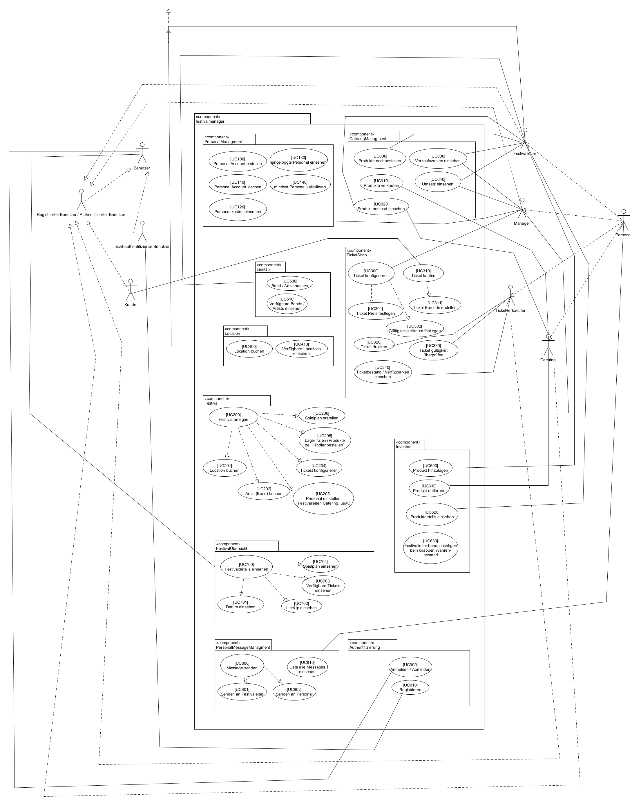
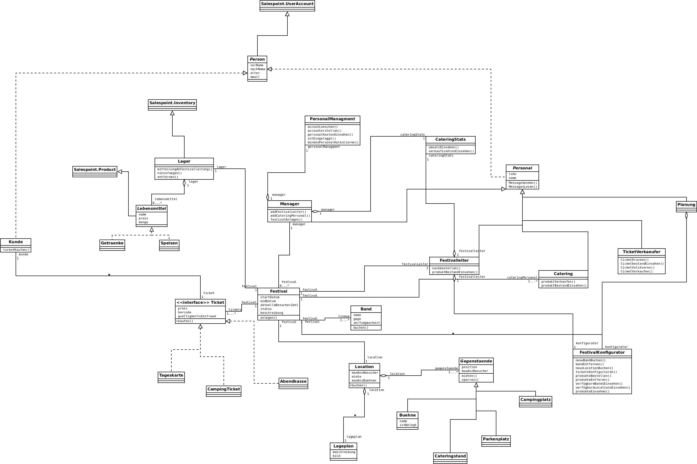

= Pflichtenheft
:project_name: Festivalmanager
== __{project_name}__

[options="header"]
[cols="1, 1, 1, 1, 4"]
|===
|Version | Status      | Bearbeitungsdatum   | Autoren(en) |  Vermerk
|0.1     | In Arbeit   | 27.10.2021          | Cornelius, Philipp, Franz, Aleksey, Conrad       | Initiale Version
|0.2     | In Arbeit   | 28.10.2021          | Conrad       | Gui-Bilder hinzugefügt
|0.3     | In Arbeit   | 31.10.2021          | Conrad       | Inhalstverzeichnis
|0.4     | In Arbeit   | 31.10.2021          | Aleksey       | Kann- / Muss-Kriterien
|0.5     | In Arbeit   | 31.10.2021          | Philipp, Franz, Aleksey, Conrad       | stackholder & überarbeitete Diagramme
|0.6     | In Arbeit   | 31.10.2021          | Conrad       | Zusammenfassung & Aufgabenstellung und Zielsetzung
|0.7     | In Arbeit   | 3.11.2021          | Franz, Aleksey, Conrad       | Sequenzdiagramme
|0.8     | In Arbeit   | 3.11.2021          | Philipp, Conrad       | Überarbeitete Diagramme, Versionen, Anwendungsfallbeschreibung, Dialogbeschreibung
|===

[[_inhaltsverzeichnis]]
== Inhaltsverzeichnis

* <<_inhaltsverzeichnis>>

* <<_zusammenfassung>>

* <<_aufgabenstellung_und_zielsetzung>>

* <<_produktnutzung>>

* <<_interessengruppen>>

* <<_systemgrenze>>

** <<_kontextdiagramm>>

** <<_top_level_arch>>

* <<_anwendungsfälle>>

** <<_akteure>>

** <<_überblick>>

** <<_anwendungsfallbeschreibung>>

* <<_funktionale_anforderungen>>

** <<_muss_kriterien>>

** <<_kann_kriterien>>

* <<_nicht_funktionale_anforderungen>>

** <<_qualitätsziele>>

** <<_nicht_funktioanle_anforderungen>>

* <<_gui_prototyp>>

** <<_dialoglandkarte>>

* <<_datenmodell>>

** <<_klassendiagramm>>

** <<_klassen_und_enumerationen>>

* <<_akzeptanztestfälle>>

* <<_glossar>>

* <<_offene_punkte>>

[[_zusammenfassung]]
== Zusammenfassung
Dies ist das Pflichtenheft für das SWT-Projet "Festivalmanager".

Der Festivalmanager ist eine Webanwendung, über welche Festivals geplant und verwaltet werden können.

Desweiteren sollen Nutzergruppen wie Cateringpersonal, Planungspersonal, Festivalleiter und Manager zugriff auf das System haben um ihren Funktionen zu erfüllen.
Das Cateringpersonal soll ein eigenes Terminal erhalten über welches sie Essen und Trinken abrechnen können.
Das Planungspersonal kann Festivals erstellen. Dazu gibt es eine Location und Terminal Auswahl, sowie die Möglichkeit Bands zu buchen.
Zusätzlich gibt es die Möglichkeit die Location zu planen und Cateringstände, Toiletten und Bühnen zu platzieren.
Der Festivalleiter hat ein Terminal in dem er die aktuellen Statistiken über das Festival sieht. Er hat zudem die Fähigkeit Lagerbestände aufzufrischen.
Es gibt ein Ticketsystem, welches Online und vor Ort benutzt wird. Dieses stellt Tickets nach einem Kauf aus und kann diese verifizieren.
Der Manager kann betriebswirtschaftliche Daten abrufen sowie angemeldete Mitarbeiter sehen.

[[_aufgabenstellung_und_zielsetzung]]
== Aufgabenstellung und Zielsetzung

Die Planungsabteilung soll Termine und Locations festlegen könnnen. Somit brauchen sie eine Vorauswahl sowie die Möglichkeit diese Auswahl zu erweiter beziehungsweise zu ändern.
Die Terminvergabe muss abgestimmt sein, sodass keine Doppeltbuchung möglich ist. Da jede Location nur bestimmt viel Platz hat muss sichergestellt werden das es nur eine bestimmte Anzahl an Tickets
gibt. In Verbindung dazu müssen pro 100 Personem mindestens eine Person des Sicherheitspersonals anwesend sein. Dies muss in der Planung berrücksichtig und durch das System sichergestellt werden.
Um den Besuchern einen angenehmen Aufenthalt zu ermöglichen soll das Planungsteam in der Lage sein Toiletten sowie Cateringstände platzieren zu können.
Ein weiter Teil der Planung besteht darin Angebote von Künstlern einzuholen, welche durch eine Vorauswahl, die bearbeitet werden kann, ermöglicht wird.

Das Cateringpersonal hat eigene Terminals, welche mit dem Lagersystem interagieren. Dies geschieht indem das Cateringpersonal Essen bzw. Getränke zu einer Abrechnung hinzufügen und diese dann,
nach Kundenbestätigung, abschicken.

Das Management hat ein eigenes Terminal in welchem Diagramme und Statisiken über die betriebswirtschaftlichen Daten des Festivals zu sehen sind. Desweiternen hat dieses eine Übersicht über alle angemeldeten Mitarbeiter. Diese Mitarbeiter können durch das Management erstellt und verwaltet werden. Der Manager ist dafür zuständig das Festival zu erstellen.

Der Festivalmanager hat eine Übersicht über Nachrichten bezüglich des Festivals sowie eine Übersicht über den Lagerberstand. Außerdem kann dieser Nachbestellungen tätigen.
In dieser Übersicht sind auch aktuelle Zahlen zu Besucherzahlen sowie Verkaufszahlen des Caterings sowie Informationen zur aktuellen Bühnenbelegung.

Die Ticketverkäufer vor Ort haben ein eigenes Terminal, in dem sie Tickets für die Abendkasse verkaufen könnnen. Damit nicht zu viele Personen auf dem Festival sind gibt es eine
automatische Beschränkung. Desweiteren sind Ticketverkäufer in der Lage Tickets am Einlass zu validieren. Dafür gibt es eine Datenbank, die die Bestellungen speichert und validieren kann.

[[_produktnutzung]]
== Produktnutzung
Der Festivalmanager ist eine all-umfassende Softwarelösung um Festivals zu erstellen, zu planen, zu leiten, sowie Tickets für diese zu Verkaufen.

Die Rahmenbedingungen für dieses System sind, dass es im Browser laufen kann und somit einfach zugänglich ist.
Desweiteren soll der Festivalmanager zweisprachig angeboten werden mit einer Möglichkeit weiter Sprachen hinzuzufügen.

[[_interessengruppen]]
== Interessensgruppen (Stakeholders)
Welche realen und juristischen Personen(-gruppen) haben Einfluss auf die Anforderungen im Projekt?

[cols="1h, 4"]
|===
|Interessengruppen |Anforderungen
|Kunde a|* gute Übersicht über bestehende Festivals
* einfacher Bestellvorgang
|Cateringpersonal a|* einfaches und intuitives Auswählen und Abrechnen von Speisen und Getränken
|Sicherheitspersonal a|* Zugriff auf ein Nachrichtensystem
|Ticketverkäufer a|* einfache bedienbares Ticketsystem 
|Festivalleiter a|* Lagerübersicht mit Nachbestellungen
* aktuelle Informationen über das Festival sollen einsehbar sein
* laufende Finanzübersicht
|Management a|* Verwaltung von Personal und Zugangsdaten
* Übersicht über betriebswirtschaftliche Daten
|Planungsteam a|* Auswahl an Locations und Künstlern
* laufende Finanzbersichte während des Planungsprozesses
* Ticketbegrenzung und Preiseinstellung
|===

[[_systemgrenze]]
== Systemgrenze und Top-Level-Architektur

[[_kontextdiagramm]]
=== Kontextdiagramm

[[_top_level_arch]]
=== Top-Level-Architektur

[[_anwendungsfälle]]
== Anwendungsfälle

[[_akteure]]
=== Akteure

Akteure sind die Benutzer des Software-Systems oder Nachbarsysteme, welche darauf zugreifen. Dokumentieren Sie die Akteure in einer Tabelle. Diese Tabelle gibt einen Überblick über die Akteure und beschreibt sie kurz. Die Tabelle hat also mindestens zwei Spalten (Akteur Name und Kommentar).
Weitere relevante Spalten können bei Bedarf ergänzt werden.

// See http://asciidoctor.org/docs/user-manual/#tables
[options="header"]
[cols="1,4"]
|===
|Name |Beschreibung
|Benutzer  a| * repräsentiert jede Person die mit dem System interagiert, unabhängig ob diese authentifiziert ist oder nicht
|Registrierter Benutzer / Authentifizierter Benutzer a|  * repräsentiert jede Person die einen Account hat, authentifiziert ist und mit dem System interagiert
|nicht-authentifizierter Benutzer a| * repräsentiert jede Person die nicht authentifiziert ist und somit nicht mit dem System interagieren kann (also Beobachter sind)
|Kunde a| * repräsentiert jede Person ohne “spezielle” Rolle (wie z.B. Catering, Festivalleiter, …), die einen Account besitzt und authentifiziert ist 
* kann Karten kaufen
|Festivalleiter a| * jeder registrierte Benutzer mit der Rolle “Festivalleiter
* ist für die Administration (nachbestellungen tätigen, Lagerbestände beobachten und Mitarbeiter anweisen) zuständig
| Catering a| * repräsentiert jede Person mit der Rolle “Catering”
* hat zugriff auf den extra Reiter “Catering”
* kann Abrechnungen tätigen (Essen, Trinken)
| Manager a| * repräsentiert jede Person mit der Rolle “Manager”
* ist für die Verteilung der Nutzeraccount des Personals verantwortlich
* hat Überblick über betriebswirtschaftliche Daten und Mitarbeiter im System

|===

[[_überblick]]
=== Überblick Anwendungsfalldiagramm

[[_anwendungsfallbeschreibung]]
=== Anwendungsfallbeschreibungen

Der Manager soll eine Festivalleiter sowie das Cateringpersonal zu einem Festival hinzufügen können. Diese kann der Manager aus einer Liste auswählen.

Der Kunde soll in der Lage sein ein Festivalticket kaufen zu können. Dazu gibt es eine Auswahl an Tickets sowie ein Feld für die Anzahl.

Der Festivalleiter kann auf das Lager zugreifen und Nachbestellungen tätigen. Dazu wird ihm eine Tabelle mit den Produkten angezeigt mit einem zugehörigem Feld, in welchem der Leiter die Menge angeben kann die nachbestellt werden soll. Diese wird dann dem Lager hinzugefügt.

image::models/analysis/images/sequenz/4.png[]

Bei der Vergabe der Parkpätze sollen diese gesperrt werden, wenn sie benutzt werden.

Bei der Vergabe der Campingplätze sollen diese gesperrt werden, wenn sie benutzt werden.

Der Manager kann ein Festival anlegen. Dafür hat er eine Form in welche er den Namen des Festivals eintragen kann.
Das Planungsteam kann dann eine Band buchen. Dazu gibt es eine Liste, welche alle Bandnamen enthält und erweitert werden kann.
Zusätzlich kann das Planungsteam auch eine Location buchen, welche ebenfalls in einer List enthalten ist, die erweitert werden kann.

Das Cateringpersonal kann nachdem eine Bestellung eingegangen ist diese abbuchen. Dabei werden die Lebensmittel aus dem Lager entfernt. 
Bei der Abbuchung wird der Preis und die Bestellung angezeigt.

Eine Location kann gebucht werden. Dabei wird sie gemietet.

Eine Bühne wird gesperrt. 

Ein Cateringstand wird gesperrt.

[cols="1h, 3"]
[[UC900]]
|===
|ID                         |**<<UC900>>**
|Name                       |Login/Logout
|Description                |Ein Benutzer soll in der Lage sein sich anmelden zu können um die Funktionen des Systems nutzen zu können. Dies wird mit dem Abbmelden rückgängig gemacht.
|Actors                     |Benutzer
|Trigger                    |
_Login_: Ein Benutzer will "versteckte" Funktionen des Systems nutzen.

_Logout_: Der Benutzer will sich abmelden.
|Precondition(s)           a|
_Login_: Der Benuter ist nicht angemeldet.

_Logout_: Der Benutzer ist angemeldet.
|Essential Steps           a|
_Login_:

    1. Der Benutzer klickt auf "Anmelden"
    2. Der Benutzer gibt seine Daten ein
    3. Der Benutzer drückt auf "Anmelden"

_Logout_:

    1. Der Benutzer klickt auf "Abmelden"
    2. Der Benutzer wird abgemeldet und gelangt auf die Hauptseite

|Extensions                 |-
|Functional Requirements    |<<F0010>>
|===

[cols="1h, 3"]
[[UC910]]
|===
|ID                         |**<<UC910>>**
|Name                       |Registrierung
|Description                |Ein Benutzer soll in der Lage sein einen Benutzeraccount zu erstellen.
|Actors                     |Benutzer
|Trigger                    |
_Registrierung_: Ein Benutzer will einen Benutzeraccount erstellen.
|Precondition(s)           a|
_Registrierung_: Der Benutzer existiert noch nicht.

|Essential Steps           a|
_Registrierung_: 

    1. Der Benutzer klickt auf "Registrieren"
    2. Der Benutzer gibt seine Daten ein
    3. Der Benutzer drückt auf "Registrieren"

|Extensions                 |-
|Functional Requirements    |<<F0010>>
|===

[cols="1h, 3"]
[[UC100]]
|===
|ID                         |**<<UC100>>**
|Name                       |Personal Account erstellen
|Description                |Der Manager erstellt einen Personal Account.
|Actors                     |Manager
|Trigger                    |
_Personal Account erstellen_: Der Manager will einen Personal Account erstellen.
|Precondition(s)           a|
_Personal Account erstellen_: Der Benutzer ist als Manager angemeldet. Der Personal Account exisitert noch nicht.

|Essential Steps           a|
_Personal Account erstellen_: 
    1. Der Manager geht auf den Reiter "Personal"
    2. Der Manager klickt auf "Neuen Personal Account erstellen"
    3. Der Manager wählt einen Benutzernamen aus
    4. Der Manager wählt ein Passwort ein
    5. Der Manager wählt eine Rolle aus
    6. Der Manager drückt auf "Erstellen"

|Extensions                 |-
|Functional Requirements    |<<F0010>>
|===

[cols="1h, 3"]
[[UC130]]
|===
|ID                         |**<<UC130>>**
|Name                       |Angemeldetes Personal Account einsehen
|Description                |Der Manager will das angemeldete Personal sehen.
|Actors                     |Manager
|Trigger                    |
_Angemeldetes Personal Account einsehen_: Der Manager will das angemeldete Personal sehen.
|Precondition(s)           a|
_Angemeldetes Personal Account einsehen_: Der Benutzer ist als Manager angemeldet.

|Essential Steps           a|
_Angemeldetes Personal Account einsehen_: 
    1. Der Manager geht auf den Reiter "Personal"

|Extensions                 |-
|Functional Requirements    |<<F0010>>
|===

[cols="1h, 3"]
[[UC110]]
|===
|ID                         |**<<UC110>>**
|Name                       |Personal Account löschen
|Description                |Der Manager will einen Personal Account löschen.
|Actors                     |Manager
|Trigger                    |
_Personal Account löschen_: Der Manager will einen Personal Account löschen.
|Precondition(s)           a|
_Personal Account löschen_: Der Benutzer ist als Manager angemeldet. Der Personal Account existiert.

|Essential Steps           a|
_Personal Account löschen_: 
    1. Der Manager geht auf den Reiter "Personal"
    2. Der Manager wählt einen Personal Account aus
    3. Der Manager drückt auf "Löschen"

|Extensions                 |-
|Functional Requirements    |<<F0010>>
|===

[cols="1h, 3"]
[[UC120]]
|===
|ID                         |**<<UC120>>**
|Name                       |Personal Kosten einsehen
|Description                |Der Manager will die Kosten des Personals sehen.
|Actors                     |Manager
|Trigger                    |
_Personal Kosten einsehen_: Der Manager will die Kosten des Personals sehen.
|Precondition(s)           a|
_Personal Kosten einsehen_: Der Benutzer ist als Manager angemeldet.

|Essential Steps           a|
_Personal Kosten einsehen_: 
    1. Der Manager geht auf den Reiter "Personal"
    2. Der Manager wählt "Kosten" aus

|Extensions                 |-
|Functional Requirements    |<<F0010>>
|===

[cols="1h, 3"]
[[UC140]]
|===
|ID                         |**<<UC140>>**
|Name                       |Mindest Personal kalkulieren
|Description                |Der Manager will will die Mindestanzahl an Sicherheitspersonal wissen.
|Actors                     |Manager
|Trigger                    |
_Mindest Personal kalkulieren_: Der Manager will die Mindestanzahl an Sicherheitspersonal wissen.
|Precondition(s)           a|
_Mindest Personal kalkulieren_: Der Benutzer ist als Manager angemeldet.

|Essential Steps           a|
_Mindest Personal kalkulieren_: 
    1. Der Manager geht auf den Reiter "Personal"

|Extensions                 |-
|Functional Requirements    |<<F0010>>
|===

[cols="1h, 3"]
[[UC800]]
|===
|ID                         |**<<UC800>>**
|Name                       |Nachricht senden
|Description                |Ein Benutzer will eine Nachricht senden
|Actors                     |Benutzer
|Trigger                    |
_Nachricht senden_: Ein Benutzer will eine Nachricht senden.
|Precondition(s)           a|
_Nachricht senden_: Der Benutzer ist angemeldet. Der Empfänger existiert.

|Essential Steps           a|
_Nachricht senden_: 

    1. Der Benutzer klickt auf "Nachricht senden"
    2. Der Benutzer wählt den Empfänger aus
    3. Der Benutzer gibt eine Nachricht ein
    4. Der Benitzer drückt auf "Senden"

|Extensions                 |-
|Functional Requirements    |<<F0010>>
|===

[cols="1h, 3"]
[[UC810]]
|===
|ID                         |**<<UC810>>**
|Name                       |Alle Nachrichten anzeigen
|Description                |Der Festivalleiter will alle Nachrichten sehen.
|Actors                     |Festivalleiter
|Trigger                    |
_Alle Nachrichten anzeigen_: Der Festivalleiter will alle Nachrichten sehen.
|Precondition(s)           a|
_Alle Nachrichten anzeigen_: Der Benutzer ist als Festivalleiter angemeldet.

|Essential Steps           a|
_Alle Nachrichten anzeigen_: 

    1. Der Festivalleiter geht auf den Reiter "Nachtichten"

|Extensions                 |-
|Functional Requirements    |<<F0010>>
|===

[cols="1h, 3"]
[[UC802]]
|===
|ID                         |**<<UC802>>**
|Name                       |Nachricht an Personal senden
|Description                |Der Festivalleiter will eine Nachricht an das Personal senden.
|Actors                     |Festivalleiter
|Trigger                    |
_Nachricht an Personal senden_: Der Festivalleiter will eine Nachrichten an das Personal senden.
|Precondition(s)           a|
_Nachricht an Personal senden_: Der Benutzer ist als Festivalleiter angemeldet.

|Essential Steps           a|
_Nachricht an Personal senden_: 

    1. Der Festivalleiter geht auf den Reiter "Nachtichten"
    2. Der Festivalleiter wählt einen Empfänger aus
    3. Der Festivalleiter gibt eine Nachricht ein
    4. Der Festivalleiter drückt auf "Senden"

|Extensions                 |-
|Functional Requirements    |<<F0010>>
|===

[cols="1h, 3"]
[[UC120]]
|===
|ID                         |**<<UC120>>**
|Name                       |Personal Kosten einsehen
|Description                |Der Manager will die Kosten des Personals sehen.
|Actors                     |Manager
|Trigger                    |
_Personal Kosten einsehen_: Der Manager will die Kosten des Personals sehen.
|Precondition(s)           a|
_Personal Kosten einsehen_: Der Benutzer ist als Manager angemeldet.

|Essential Steps           a|
_Personal Kosten einsehen_: 
    1. Der Manager geht auf den Reiter "Personal"
    2. Der Manager wählt "Kosten" aus

|Extensions                 |-
|Functional Requirements    |<<F0010>>
|===

[cols="1h, 3"]
[[UC140]]
|===
|ID                         |**<<UC140>>**
|Name                       |Mindest Personal kalkulieren
|Description                |Der Manager will will die Mindestanzahl an Sicherheitspersonal wissen.
|Actors                     |Manager
|Trigger                    |
_Mindest Personal kalkulieren_: Der Manager will die Mindestanzahl an Sicherheitspersonal wissen.
|Precondition(s)           a|
_Mindest Personal kalkulieren_: Der Benutzer ist als Manager angemeldet.

|Essential Steps           a|
_Mindest Personal kalkulieren_: 
    1. Der Manager geht auf den Reiter "Personal"

|Extensions                 |-
|Functional Requirements    |<<F0010>>
|===

[cols="1h, 3"]
[[UC000]]
|===
|ID                         |**<<UC000>>**
|Name                       |Produkte nachbestellen
|Description                |Der Festivalleiter will ein Produkt nachbestellen.
|Actors                     |Festivalleiter
|Trigger                    |
_Produkte nachbestellen_: Der Festivalleiter will ein Produkt nachbestellen.
|Precondition(s)           a|
_Produkte nachbestellen_: Der Benutzer ist als Festivalleiter angemeldet.

|Essential Steps           a|
_Produkte nachbestellen_: 
    1. Der Festivalleiter geht auf den Reiter "Lager"
    2. Der Festivalleiter wählt ein Produkt aus
    3. Der Festivalleiter wählt eine Menge aus
    4. Der Festivalleiter drückt auf "Nachbestellen"

|Extensions                 |-
|Functional Requirements    |<<F0010>>
|===

[cols="1h, 3"]
[[UC030]]
|===
|ID                         |**<<UC030>>**
|Name                       |Verkaufszahlen einsehen
|Description                |Der Festivalleiter will die Verkaufszahlen einsehen.
|Actors                     |Festivalleiter
|Trigger                    |
_Verkaufszahlen einsehen_: Der Festivalleiter will die Verkaufszahlen einsehen.
|Precondition(s)           a|
_Verkaufszahlen einsehen_: Der Benutzer ist als Festivalleiter angemeldet.

|Essential Steps           a|
_Verkaufszahlen einsehen_: 
    1. Der Festivalleiter geht auf den Reiter "Verkauf"

|Extensions                 |-
|Functional Requirements    |<<F0010>>
|===

[cols="1h, 3"]
[[UC040]]
|===
|ID                         |**<<UC040>>**
|Name                       |Umsatz einsehen
|Description                |Der Festivalleiter will den Umsatz einsehen.
|Actors                     |Festivalleiter
|Trigger                    |
_Umsatz einsehen_: Der Festivalleiter will den Umsatz einsehen.
|Precondition(s)           a|
_Umsatz einsehen_: Der Benutzer ist als Festivalleiter angemeldet.

|Essential Steps           a|
_Umsatz einsehen_: 
    1. Der Festivalleiter geht auf den Reiter "Umsatz"

|Extensions                 |-
|Functional Requirements    |<<F0010>>
|===

[cols="1h, 3"]
[[UC020]]
|===
|ID                         |**<<UC020>>**
|Name                       |Produktbestand einsehen
|Description                |Der Festivalleiter den Produktbestand einsehen.
|Actors                     |Festivalleiter
|Trigger                    |
_Produktbestand einsehen_: Der Festivalleiter will den Produkbestand einesehen.
|Precondition(s)           a|
_Produktbestand einsehen_: Der Benutzer ist als Festivalleiter angemeldet.

|Essential Steps           a|
_Produktbestand einsehen_: 
    1. Der Festivalleiter geht auf den Reiter "Lager"

|Extensions                 |-
|Functional Requirements    |<<F0010>>
|===

[cols="1h, 3"]
[[UC400]]
|===
|ID                         |**<<UC400>>**
|Name                       |Band/ Artist buchen
|Description                |Das Planungsteam will eine Band / einen Künstler buchen.
|Actors                     |Planungsteam
|Trigger                    |
_Band/ Artist buchen_: Das Planungsteam will eine Band / einen Künstler buchen.
|Precondition(s)           a|
_Band/ Artist buchen_: Der Benutzer ist als Planungsteammitglied angemeldet.

|Essential Steps           a|
_Band/ Artist buchen_: 
    1. Der Benutzer geht auf den Reiter "Planung"
    2. Der Benutzer wählt eine Band / einen Künstler aus
    3. Der Benutzer wählt eine Zeitraum aus
    4. Der Benutzer klickt auf "Buchen"

|Extensions                 |-
|Functional Requirements    |<<F0010>>
|===

[cols="1h, 3"]
[[UC510]]
|===
|ID                         |**<<UC510>>**
|Name                       |Verfügbare Bands / Artists einsehen
|Description                |Das Planungsteam will die verfügbaren Bands / Artists einsehen.
|Actors                     |Planungsteam
|Trigger                    |
_Verfügbare Bands / Artists einsehen_: Das Planungsteam will die verfügbaren Bands / Artists einsehen.
|Precondition(s)           a|
_Verfügbare Bands / Artists einsehen_: Der Benutzer ist als Planungsteammitglied angemeldet.

|Essential Steps           a|
_Verfügbare Bands / Artists einsehen_: 
    1. Der Benutzer geht auf den Reiter "Planung"
    2. Der Benutzer wählt eine Band / einen Künstler aus

|Extensions                 |-
|Functional Requirements    |<<F0010>>
|===

[cols="1h, 3"]
[[UC400]]
|===
|ID                         |**<<UC400>>**
|Name                       |Location buchen
|Description                |Das Planungsteam will eine Location buchen.
|Actors                     |Planungsteam
|Trigger                    |
_Location buchen_: Das Planungsteam will eine Location buchen.
|Precondition(s)           a|
_Location buchen_: Der Benutzer ist als Planungsteammitglied angemeldet.

|Essential Steps           a|
_Location buchen_: 
    1. Der Benutzer geht auf den Reiter "Planung"
    2. Der Benutzer wählt eine Location aus
    3. Der Benutzer wählt eine Zeitraum aus
    4. Der Benutzer klickt auf "Buchen"

|Extensions                 |-
|Functional Requirements    |<<F0010>>
|===

[cols="1h, 3"]
[[UC410]]
|===
|ID                         |**<<UC410>>**
|Name                       |Verfügbare Locations einsehen
|Description                |Das Planungsteam will die verfügbaren Locations einsehen.
|Actors                     |Planungsteam
|Trigger                    |
_Verfügbare Locations einsehen_: Das Planungsteam will die verfügbaren Locations einsehen.
|Precondition(s)           a|
_Verfügbare Locations einsehen_: Der Benutzer ist als Planungsteammitglied angemeldet.

|Essential Steps           a|
_Verfügbare Locations einsehen_: 
    1. Der Benutzer geht auf den Reiter "Planung"

|Extensions                 |-
|Functional Requirements    |<<F0010>>
|===

[cols="1h, 3"]
[[UC200]]
|===
|ID                         |**<<UC200>>**
|Name                       |Festival anlegen
|Description                |Der Manager legt ein Festival an.
|Actors                     |Manager
|Trigger                    |
_Festival anlegen_: Der Manager will ein Festival anlegen.
|Precondition(s)           a|
_Festival anlegen_: Der Benutzer ist als Manager angemeldet.

|Essential Steps           a|
_Festival anlegen_: 
    1. Der Manager geht auf den Reiter "Planung"
    2. Der Manager wählt "Erstellen" aus
    3. Der Manager wählt Location aus [UC201]
    4. Der Manager wählt Artists (Bands) aus [UC202]
    5. Der Manager wählt das Personal aus (aus den bereits erstellten Personal Accounts) [UC203]
    6. Der Manager konfiguriert die Tickets [UC204]
    7. Der Manager legt den benötigten Lagerbestand fest [UC205]
    8. Der Manager erstellt einen Spielplan [UC206]

|Extensions                 |-
|Functional Requirements    |<<F0010>>
|===

[cols="1h, 3"]
[[UC0010]]
|===
|ID                         |**<<UC700>>**
|Name                       |Festival Übersicht
|Description                |Ein benutzer hat zugriff auf eine Festivalübersicht
|Actors                     |Benutzer
|Trigger                    |
_Festival Übersicht anschauen_: Der Benutzer will die zurzeit verfügbaren Festivals einsehen.
|Precondition(s)           a|
_Festival Übersicht anschauen_: benötigt keine besonderen Vorbedingungen (selbst unauthentifizierte Benutzer können die Übersicht einsehen)

|Essential Steps           a|
_Festival Übersicht anschauen_: 
    1. Der Benutzer geht auf die index Seite (localhost:8080) oder klickt auf das Logo der Webseite in der Navigationsleiste falls der Benutzer bereits auf einer anderen Route auf der Webseite ist.
    2. Benutzer wird eine Liste mit den aktuell verfügbaren Festival angezeigt sowie Informationen wie z.B. Datum [UC701], LineUp [UC702], verfügbare Tickets [UC703], Spielplan [UC704]

|Extensions                 |-
|Functional Requirements    |<<F0010>>
|===

[cols="1h, 3"]
[[UC301]]
|===
|ID                         |**<<UC301>>**
|Name                       |Ticketpreis festlegen
|Description                |Der Manager kann den Ticketpreis festlegen
|Actors                     |Manager
|Trigger                    |
_Ticketpreis festlegen_: Der Manager will den Ticketpreis festlegen.
|Precondition(s)           a|
_Ticketpreis festlegen_: Der Benutzer ist als Manager angemeldet.

|Essential Steps           a|
_Ticketpreis festlegen_: 
    1. Der Manager geht auf den Reiter "Planung"
    2. Der Manager wählt ein Festival aus
    3. Der Manager wählt ein Ticket aus
    4. Der Manager wählt den Ticketpreis aus
    5. Der Manager klickt auf "Speichern"

|Extensions                 |-
|Functional Requirements    |<<F0010>>
|===

[cols="1h, 3"]
[[UC310]]
|===
|ID                         |**<<UC310>>**
|Name                       |Ticket kaufen
|Description                |Ein Kunde will ein Ticket kaufen
|Actors                     |Kunde
|Trigger                    |
_Ticket kaufen_: Der Kunde will ein Ticket kaufen.
|Precondition(s)           a|
_Ticket kaufen_: Der Benutzer ist als Kunde angemeldet.

|Essential Steps           a|
_Ticket kaufen_: 
    1. Der Kunde geht auf den Reiter "Festivals"
    2. Der Kunde wählt ein Festival aus
    3. Der Kunde wählt ein Ticket aus
    4. Der Kunde klickt auf "Kaufen"

|Extensions                 |-
|Functional Requirements    |<<F0010>>
|===

[[_funktionale_anforderungen]]
== Funktionale Anforderungen

[[_muss_kriterien]]
=== Muss-Kriterien
Was das zu erstellende Programm auf alle Fälle leisten muss.

* Benutzerfreundliche Software.

* Die passende Location muss gebucht werden. Doppelbuchungen vermeiden.

* Locationunterteilung. Jeder Teil (Camping-, Park-, Catering- und Stage-Bereiche) hat maximale Besucherzahl.
* "Line - up"
- Angebote bei verschiedenen Künstlern einholen.
- Speiseplan für jede Bühne
- Buchungen von Sicherheitspersonal (mindestens einer pro 100 Besuchern), Bedienungen an den Cateringständen, Bühnentechniker (Anzahl wird durch die Band bestimmt), Veranstaltungsleiter.
* Visualisierung des Geländes.
* Festivalanpassungen. (Bühnenpositionierung, Toilettenbestückung und Cateringstände, bestimmte Bereiche sperren. 
Diese Gegenstände werden von externen Anbietern gemietet.)
* Automatische Kostenaufstellung. (Kosten für Mieten, Gagen, Personal und Sonstigem aufgelisten und aggregieren.)
* Verkaufsmitarbeiter können Tickets verkaufen und ausdrucken.
* Tickets haben ein Barcode bzw. eine eindeutige Nummer. Vermeiden,dass verschiedene Personen das Gelände mit derselben Karte betreten.
* Cateringpersonal kann sich an entsprechenden Terminals am Verkaufsstand mit gültigem Login anmelden.
* System soll die Möglichkeit bieten, Getränke und Speisen auswählen und abrechnen. Bei wenigem Bestand bekommt Festivalleiter eine Mitteilung.
* An dem Terminal von Festivalleiter sind zu sehen:
- Lagerbestand. Möglichkeit,Nachbestellungen zu tätigen. 
- Aktuelle Besucherzahlen.
- Nachrichen von anderen Mitarbeitern.
- Verkaufszahlen des Caterings.
- Aktuelle Bühnenbelegung.
* Alle Benurzer können Spielplan sowie Plan des Geländes für alle Tage sehen
* Manager verteilt Logins an Mitarbeiter.
* Manager sieht, wer momentan angemeldet ist.
* Manager ruft die betriebswirtschaftlichen Daten ab. (Ausgaben, Umsatz, usw.). Das muss grafisch visualisiert sein.

[[_kann_kriterien]]
=== Kann-Kriterien
Anforderungen die das Programm leisten können soll, aber für den korrekten Betrieb entbehrlich sind.

* Das System hat einen Kalender für die Kunden, um die Tickets für die anstehenden Fevtivals buchen zu können.

* Das System ausrechnet und bietet Rabatte für die Stammkunden.

* Rundmail mit den Infos über die Festivals

[[_nicht_funktionale_anforderungen]]
== Nicht-Funktionale Anforderungen

[[_qualitätsziele]]
=== Qualitätsziele

Die folgende Tabelle zeigt,
welche Qualitätsansprüche in welchem Umfang erfüllt werden müssen.
Die erste Spalte listet die Qualitätsanforderungen auf,
während in den folgenden Spalten ein "x" zur Kennzeichnung der Priorität verwendet wird.

1 = nicht wichtig --- 5 = sehr wichtig
[options="header", cols="3h, ^1, ^1, ^1, ^1, ^1"]
|===
|Qualitätsziel             | 1 | 2 | 3 | 4 | 5
|Instandhaltung            |   |   |   | x |
|Erweiterbarkeit           |   |   |   | x |
|Benutzer Feundlichkeit    |   |   |   |   | x
|Sicherheit                |   |   |   | x |
|===

[[_nicht_funktioanle_anforderungen]]
=== Konkrete Nicht-Funktionale Anforderungen

Beschreiben Sie Nicht-Funktionale Anforderungen, welche dazu dienen, die zuvor definierten Qualitätsziele zu erreichen.
Achten Sie darauf, dass deren Erfüllung (mindestens theoretisch) messbar sein muss.

[[_gui_prototyp]]
== GUI Prototyp

Index

Die Hauptseite behinhaltet eine Liste von Festivals.
Diese sind dann mit der Detailseite des Festivals verlinkt.

image::models/analysis/images/uebergang/login_login.png[]

Login

Die Loginseite ermöglicht es, sich anzumelden.
Dafür gibt es ein Eingabefeld für den Benutzernamen und ein Passwort.

image::models/analysis/images/uebergang/login_register.png[]

Register

Die Registerseite ermöglicht es, sich zu registrieren.
Dafür gibt es ein Eingabefeld für den Benutzernamen und ein Passwort, sowie für die Addresse und die E-Mailaddresse.

image::models/analysis/images/uebergang/festival_buy.png[]

Festival Tickets kaufen

Die Festival-Tickets-kaufen Seite ermöglicht es, Tickets für das ausgewählte Festival zu kaufen.
Hier gibt es eine Auswahl an unterschiedlichen Tickets, sowie ein Feld für die Anzahl der Tickets.

image::models/analysis/images/uebergang/festival_festival.png[]

Festival Details

Auf der Detailseite des Festivals werden die Details des Festivals angezeigt.
Dies beinhaltet eine kurze Beschreibung, die Zeit, das Lineup sowie einen Verweis auf die Kaufseite. 

Line Up hinzufügen / Ändern

Auf der Lineup-Ändern/Hinzufügen-Seite kann man das Lineup ändern.
Dazu gibt es eine Auswahlt an Zeiten, eine Auswahl an Bühnen sowie eine Auswahl an Bands.
Um keine Doppeltbuchung zu ermöglichen werden nur Bands angezeigt die zu der Zeit noch frei sind.

Kosten während der Planung

Die Seite Koste-Planung zeigt die Kosten während der Planung an.
Dies beinhaltet Fix-Kosten wie Essen und Getränke sowie Variable-Kosten wie die Anzahl der Tickets.

image::models/analysis/images/uebergang/planning_editstaff.png[]

Personalbelegung ändern

Die Seite Personalbelegung-Ändern ermöglicht es, die Personalbelegung zu ändern.
Dafür gibt es eine Auswahl an Personal-Accounts, welche eine Festival hinzugefügt werden können.
Diese werden dann in einer Liste angezeigt.

Liste aktueller Festivals

Die Seite Liste-Aktueller-Festivals zeigt die aktuellen Festivals an, welche ein Planer gerade plant.
Dies beinhaltet eine Liste mit den Festivals, sowie einen Verweis auf das jeweilige Festival um es weiter zu planen oder zu bearbeiten.

image::models/analysis/images/uebergang/planning_lineup.png[]

Line Up in Tabellenformat

Die Seite Line-Up zeigt das aktuelle LineUp in einer Tabellen-Form an.

image::models/analysis/images/uebergang/planning_main.png[]

Übersicht und Verlinkung der einzelnen Planungsphasen

Die Seite Planungsphasen zeigt eine Übersicht der einzelnen Planungsphasen an, sowie einen Verweis auf die jeweilige Planungsphase.

image::models/analysis/images/uebergang/planning_phase1.png[]

Termin- und Locationauswahl

Die Seite Termin-und-Locationauswahl ermöglicht es, festzulegen, wann ein Festival stattfinden soll, sowie auf welcher Location.

image::models/analysis/images/uebergang/planning_positionierung.png[]

Positionierung der einzelnen Bereiche mit Lageplan

Die Seite Positionierung soll es ermöglichen Bereiche zu positionieren, sowie einen Lageplan zu erstellen.
Dazu kann man entweder ein Bild hochladen oder Sperrblöcke verschieben.

image::models/analysis/images/uebergang/planning_ticketprice.png[]

Ticketpreise ändern

Die Seite ermöglicht es die Ticketpreise für ein Festival zu ändern. Dazu gibt es jeweils ein Eingabefeld für den Preis.

image::models/analysis/images/uebergang/terminal_catering_main.png[]

Hauptterminal des Cateringpersonals

Das Hauptterminal des Cateringpersonals zeigt eine Übersicht aller verfügbaren Speisen und Getränke an.
Hier können die Speisen und Getränke einer Bestellung hinzugefügt werden.

Hinzufügen eines Artikels (Essen/Trinke) mit Menge

Hier kann die Menge eines Artikels für eine Bestellung festgelegt werden.

Abrechnung/Abbuchung einer Bestellung

Die Seite der Catering-Abrechnung ermöglicht es eine Bestellung abzubuchen, sowie vorher eine Übersicht über die Bestellung zu haben.

Lagerbestandsübersicht des Festivalleiters

Diese Seite ermöglciht es dem Festivalleiter den Lagerbestand in einer Tabelle anzeigen zu lassen. Zusätzlich kann er über zugehörige Felder Artikel nachbestellen.

Übersicht über den Umsatz, Nachrichten, aktuelle Bühnenbelegung und die aktuellen Besucherzahlen

Die Dashboard-Seite zeigt dem Leiter aktuelle Informationen über den Umsatz, die Nachrichten, die aktuelle Bühnenbelegung und die aktuelle Besucherzahlen an.

image::models/analysis/images/uebergang/terminal_free_free.png[]

Freies Terminal mit Lageplan und Lineup

Die Seite zeigt dem Festivalbesucher vor Ort den Lageplan und das LineUp an.

Übersicht des Managers über Mitarbeiter und die Finanzen

Diese Seite zeigt dem Manager eine Übersicht über alle Mitarbeiter und die Finanzen an.

Übergangsdiagramm

[[_dialoglandkarte]]
=== Überblick: Dialoglandkarte
Erstellen Sie ein Übersichtsdiagramm, das das Zusammenspiel Ihrer Masken zur Laufzeit darstellt. Also mit welchen Aktionen zwischen den Masken navigiert wird.
//Die nachfolgende Abbildung zeigt eine an die Pinnwand gezeichnete Dialoglandkarte. Ihre Karte sollte zusätzlich die Buttons/Funktionen darstellen, mit deren Hilfe Sie zwischen den Masken navigieren.

[[_datenmodell]]
== Datenmodell

[[_klassendiagramm]]
=== Überblick: Klassendiagramm

[[_klassen_und_enumerationen]]
=== Klassen und Enumerationen
Dieser Abschnitt stellt eine Vereinigung von Glossar und der Beschreibung von Klassen/Enumerationen dar. Jede Klasse und Enumeration wird in Form eines Glossars textuell beschrieben. Zusätzlich werden eventuellen Konsistenz- und Formatierungsregeln aufgeführt.

[options="header"]
|===
|Klasse/Enumeration |Beschreibung
|Festival	    | Zentrale Klasse
|Festivalleiter	| Leiter eines einzelnen Festivals
|Manager		| Als Administrator registrierter Benutzer
|Personal	    | Angestellte, welche vom Festivalleiter oder Manager für Festivals gebucht.
|Band		    | Angestellte. Werden vom Festivalleiter oder Manager für Festivals gebucht werden können
|Location	    | Ort, an dem das Festival stattfindet
|Gegenstaende   | Orte/Plätze auf einem Festival
|Buehne         | Möglicher Ort an einer Location
|Campingplatz   | Möglicher Ort an einer Location
|Cateringstand  | Möglicher Ort an einer Location
|Parkplatz      | Möglicher Ort an einer Location
|Ticket		    | Produkt. wird vor dem Festival verkauft
|Tageskarte	    | Basis version eines Tickets
|CampingTicket	| Möglliche Erweiterung eines Tickets
|Abendkasse	    | Möglichkeit Tickets nach dem Vorverkauf zu erwerben
|Lager		    | Hier werden die Lebensmittel aufbewahrt
|Lebensmittel	| Produkt. Wird während dem Festival verkauft
|Getraenke	    | Mögliche Art eines Lebensmittels im Lager
|Speisen		| Mögliche Art eines Lebensmittels im Lager
|===

[[_akzeptanztestfälle]]
== Akzeptanztestfälle

:Pre: Vorraussetzung(en)
:Event: Ereignis
:Result: Erwartetes Ergebnis

[cols="1h, 4"]
|===
|ID            |<<AT0001>>
|Use Case      |<<UC0001>>
|{Pre}        a|Es existiert ein Benutzer (Hans, 123) im System
|{Event}      a|Ein vorhandener Benutzer geht auf die Login-Seite, gibt seine Daten ein (Hans, 123) und drückt "Anmelden"
|{Result}     a|
- Der Benutzer ist nun als Hans authentifiziert
- Je nach Benutzergruppe (Customer, Boss, Catering, ...) werden ihm entsprechende Reiter angezeigt
- Der Benutzer wird auf die Startseite weitergeleitet, wo im rechts oben sein Name angezeigt wird
- Der Benutzer hat nun die Berechtigungen Dinge der Benutzergruppe "Custome" zu tun, wie zum Beispiel Tickets kaufen
|===

[cols="1h, 4"]
|===
|ID            |<<AT0002>>
|Use Case      |<<UC0001>>
|{Pre}        a|Der Benutzer "Hans" ist noch nicht im System enthalten
|{Event}      a|Ein Benutzer geht auf die Registrierungsseite und füllt das Registrieungsformular aus (Hans, 123) und drückt "Registriern"
|{Result}     a|
- Es wird der Benutzer "Hans" hinzugefügt
- Der Benutzer ist nun als "Hans" authentifiziert
- Der Benutzer wird auf die Startseite weitergeleitet, wo im rechts oben sein Name angezeigt wird
- Der Benutzer hat nun die Berechtigungen Dinge der Benutzergruppe "Custome" zu tun, wie zum Beispiel Tickets kaufen
|===

[cols="1h, 4"]
|===
|ID            |<<AT0003>>
|Use Case      |<<UC0001>>
|{Pre}        a|Es ist ein Benutzer im System angemeldet
|{Event}      a|Der Benutzer drückt auf "Abmelden"
|{Result}     a|
- Der Benutzer ist nun abgemeldet und nicht mehr authentifiziert
- Der Benutzer kann nur noch die Festivals anschauen und sich anmelden / registrieren
|===

[cols="1h, 4"]
|===
|ID            |<<AT0004>>
|Use Case      |<<UC0001>>
|{Pre}        a|Ein Benutzer ist nicht angemeldet, der Benutzer (Hans, 123) existiert schon
|{Event}      a|Ein Benutzer geht auf die Registrierungsseite und füllt das Registrieungsformular aus (Hans, 123) und drückt "Registriern"
|{Result}     a|
- Eine Fehlermeldung wird angezeigt um dem Benutzer zu signalisieren, dass der Benutzer (Hans) schon existiert
|===

[cols="1h, 4"]
|===
|ID            |<<AT0005>>
|Use Case      |<<UC0002>>
|{Pre}        a|Der Benutzer ist als Catering Personal angemeldet, Cola-Vorrat: 100x
|{Event}      a|Der Benutzer drückt Cola
|{Result}     a|
- Der Benutzer wird auf die Seite von "Cola" weitergeleitet
|===

[cols="1h, 4"]
|===
|ID            |<<AT0006>>
|Use Case      |<<UC0002>>
|{Pre}        a|Der Benutzer ist als Catering Personal angemeldet und hat auf "Cola" gedrückt
|{Event}      a|Der Benutzer gibt die Anzahl ein (5) und bestätigt
|{Result}     a|
- 5x Cola wird dem Wahrenkorb hinzugefügt
- Der Benutzer wird auf die Catering-Hauptseite weitergeleitet
|===

[cols="1h, 4"]
|===
|ID            |<<AT0006>>
|Use Case      |<<UC0002>>
|{Pre}        a|Der Benutzer ist als Catering Personal angemeldet und hat auf "Cola" gedrückt, Cola Vorrat ist bei 4x
|{Event}      a|Der Benutzer gibt die Anzahl ein (5) und bestätigt
|{Result}     a|
- Fehlermeldung wird angezeigt: Cola Vorrat bei 4 - Bestellt 5
- Der Benutzer wird auf die Catering-Hauptseite weitergeleitet
|===

[cols="1h, 4"]
|===
|ID            |<<AT0006>>
|Use Case      |<<UC0002>>
|{Pre}        a|Der Benutzer ist als Catering Personal angemeldet und hat auf "Cola" gedrückt, Cola Vorrat ist bei 4x
|{Event}      a|Der Benutzer gibt die Anzahl ein (5) und bestätigt
|{Result}     a|
- Fehlermeldung wird angezeigt: Cola Vorrat bei 4 - Bestellt 5
- Der Benutzer wird auf die Catering-Hauptseite weitergeleitet
|===

[cols="1h, 4"]
|===
|ID            |<<AT0007>>
|Use Case      |<<UC0002>>
|{Pre}        a|Der Benutzer ist als Catering Personal angemeldet
|{Event}      a|Der Benutzer drückt auf "Abrechnen"
|{Result}     a|
- Der Benutzer wird auf die Catering-Abrechnungsseite weitergeleitet
|===

[cols="1h, 4"]
|===
|ID            |<<AT0008>>
|Use Case      |<<UC0002>>
|{Pre}        a|Der Benutzer ist als Catering Personal angemeldet und befindet sich auf der Abrechnungsseite
|{Event}      a|Der Kunde hat bezahlt und der Benutzer drückt auf "Abrechnen"
|{Result}     a|
- Der Wahrenkorbinhalt wird vom Lager abgezogen
- Der Benutzer wird auf die Catering-Hauptseite weitergeleitet
|===

[cols="1h, 4"]
|===
|ID            |<<AT0009>>
|Use Case      |<<UC0003>>
|{Pre}        a|Für Cola wurde im Lagersystem eine Mindesgrenze von 50 gesetzt
|{Event}      a|Ein Benutzer des Cateringpersonals rechnet 3 Colas ab und der Bestand von Cola fällt unter 50
|{Result}     a|
- Der Festivalleiter bekommt eine Nachricht, dass der Mindesbestand von Cola unterschritten wurde
|===

[cols="1h, 4"]
|===
|ID            |<<AT0010>>
|Use Case      |<<UC0003>>
|{Pre}        a|Ein Benutzer ist als Festivalleiter angemeldet und ist auf seiner Nachbestellseite
|{Event}      a|Der Benutzer gibt bei "Cola" einen Nachbestellwert von 300 ein und drückt auf "Nachbestellen"
|{Result}     a|
- Es wird 300 x Cola nachbestellt (Lagerstand erhöht sich um 300)
- Der Benutzer wird auf die Nachbestellseite weitergeleitet
|===

[cols="1h, 4"]
|===
|ID            |<<AT0011>>
|Use Case      |<<UC0004>>
|{Pre}        a|Es exisitert ein Benutzer der als Mitarbeiter gekennzeichnet ist (z.B. Catering)
|{Event}      a|Der Benutzer meldet sich mit einem Mitarbeiterkonto an
|{Result}     a|
- Die Liste mit angemeldeten Mitarbeitern wird um den Benutzer erweitert
- Mitarbeiterliste des Managers wird bei Neuaufruf aktualisiert 
|===

[cols="1h, 4"]
|===
|ID            |<<AT0012>>
|Use Case      |<<UC0004>>
|{Pre}        a|Ein Benutzer der als Mitarbeiter gekennzeichnet ist (z.B. Catering) ist angemeldet
|{Event}      a|Der Benutzer meldet sich ab
|{Result}     a|
- Der Benutzer wird aus der Liste mit angemeldeten Mitarbeitern entfernt 
- Mitarbeiterliste des Managers wird bei Neuaufruf aktualisiert 
|===

[cols="1h, 4"]
|===
|ID            |<<AT0013>>
|Use Case      |<<UC0005>>
|{Pre}        a|Ein Benutzer der als Mitarbeiter gekennzeichnet ist (z.B. Catering) ist angemeldet
|{Event}      a|Der Benutzer rechnet eine Speise / ein Getränk ab (1x Cola für 3€)
|{Result}     a|
- Betriebswirtschaftliche Daten werden aktualisiert (Umsatz geht um 3€ hoch)
|===

[cols="1h, 4"]
|===
|ID            |<<AT0014>>
|Use Case      |<<UC0006>>
|{Pre}        a|Ein Benutzer der im Planungsteam ist, ist angemeldet
|{Event}      a|Der Benutzer fügt eine Band hinzu (für 50.000€)
|{Result}     a|
- Kostenaufstellung word aktualisiert (Kosten gehen um 50.000€ hoch)
|===

[cols="1h, 4"]
|===
|ID            |<<AT0015>>
|Use Case      |<<UC0007>>
|{Pre}        a|Ein Benutzer der als Mitarbeiter gekennzeichnet ist (z.B. Catering) ist angemeldet
|{Event}      a|Der Benutzer bucht 3x Cola ab
|{Result}     a|
- Lageranzeige des Festivalmanagers altualisiert sich (3x weniger Cola)
|===

[cols="1h, 4"]
|===
|ID            |<<AT0110>>
|Use Case      |<<UC0110>>
|{Pre}        a|Ein Benutzer(Festival user) benutzt ein freies Terminal
|{Event}      a|Ein angemeldeter Benutzer(Festival user) benutzt ein Terminal und lässt sich den Lageplan anzeigen
|{Result}     a|
- Der Benutzer ist nun als Festival user authentifiziert
- Der Benutzer wird auf die Startseite weitergeleitet, wo ihm der Lapeplan und das Lineup angezeigt wird
|===

[cols="1h, 4"]
|===
|ID            |<<AT0111>>
|Use Case      |<<UC0111>>
|{Pre}        a|
- Ein Planungsmitarbeiter benutzt das System
- es existiert noch kein Event an Termin(11.11.2021) in Location(Dresden)
|{Event}      a|Ein Planungsmitarbeiter legt einen Termin(11.11.2021) und eine Location(Dresden) fest
|{Result}     a|
- Es wird ein neues Event erstellt mit dem Termin (11.11.2021) in Location(Dresden)
|===

[cols="1h, 4"]
|===
|ID            |<<AT0112>>
|Use Case      |<<UC0112>>
|{Pre}        a|
- Ein Planungsmitarbeiter benutzt das System
- es existiert ein Event an Termin(11.11.2021) in Location(Dresden)
|{Event}      a|Ein Planungsmitarbeiter legt einen Termin(11.11.2021) und eine Location(Dresden) fest
|{Result}     a|
- Fehlermeldung: Es können nicht mehrere Events zur gleichen Zeit an der gleichen Location sein
- Es existiert bereits ein Event an Termin(11.11.2021) in Location(Dresden)
|===

[cols="1h, 4"]
|===
|ID            |<<AT0113>>
|Use Case      |<<UC0113>>
|{Pre}        a|
- Ein Planungsmitarbeiter benutzt das System
- Band (ZYX) hat kein Lineup an Termin(11.11.2021) mit Location(Dresden)
|{Event}      a|Ein Planungsmitarbeiter legt Lineup für Band(ZYX)an Termin(11.11.2021) und Location(Dresden) fest
|{Result}     a|
- Es wird ein neues Lineup erstellt mit der Band(ZYX) an Termin (11.11.2021) in Location(Dresden)
|===

[cols="1h, 4"]
|===
|ID            |<<AT0114>>
|Use Case      |<<UC0114>>
|{Pre}        a|
- Ein Planungsmitarbeiter benutzt das System
- Band (ZYX) hat ein Lineup an Termin(11.11.2021) mit Location(Leipzig)
|{Event}      a|Ein Planungsmitarbeiter legt Lineup für Band(ZYX)an Termin(11.11.2021) und Location(Dresden) fest
|{Result}     a|
- Fehlermeldung: Band(ZYX) kann nicht Zeitgleich an zwei Events spielen
- Band(ZYX) hat bereits ein Lineup an Termin (11.11.2021) in Location(Leipzig)
|===

[cols="1h, 4"]
|===
|ID            |<<AT0115>>
|Use Case      |<<UC0115>>
|{Pre}        a|Planungsmitarbeiter benutzt System
|{Event}      a|Planungsmitarbeiter legt Preis(30€) fest für Event(Event1)
|{Result}     a|Event(Event1) erhält Preis(30€)
|===

[cols="1h, 4"]
|===
|ID            |<<AT0116>>
|Use Case      |<<UC0116>>
|{Pre}        a|
- Planungsmitarbeiter benutzt System
- Event(Event1) hat Preis(20€)
|{Event}      a|Planungsmitarbeiter legt Preis(30€) fest für Event(Event1)
|{Result}     a|Event(Event1) erhält Preis(30€)
|===

[cols="1h, 4"]
|===
|ID            |<<AT0117>>
|Use Case      |<<UC0117>>
|{Pre}        a|Planungsmitarbeiter benutzt System
|{Event}      a|Planungsmitarbeiter läd Lageplan(Lageplan1) für Event(Event1) hoch
|{Result}     a|Event(Event1) erhält den Lageplan(Lageplan1)
|===

[cols="1h, 4"]
|===
|ID            |<<AT0118>>
|Use Case      |<<UC0118>>
|{Pre}        a|
-Planungsmitarbeiter benutzt System
-Event(Event1) besitzt Lageplan(Lageplan1)
|{Event}      a|Planungsmitarbeiter läd Lageplan(Lageplan1.1) für Event(Event1) hoch
|{Result}     a|Event(Event1) erhält den Lageplan(Lageplan1.1)
|===

[cols="1h, 4"]
|===
|ID            |<<AT0119>>
|Use Case      |<<UC0119>>
|{Pre}        a|
- Planungsmitarbeiter benutzt System
- Event(Event1) hat MindestanzahlSecusity(30)
|{Event}      a|Planungsmitarbeiter legt SecurityPersonal(35) fest für Event(Event1)
|{Result}     a|
- Event(Event1) hat SecurityPersonal(35)
|===

[cols="1h, 4"]
|===
|ID            |<<AT0120>>
|Use Case      |<<UC0120>>
|{Pre}        a|
- Planungsmitarbeiter benutzt System
- Event(Event1) hat MindestanzahlSecusity(30)
|{Event}      a|Planungsmitarbeiter legt SecurityPersonal(25) fest für Event(Event1)
|{Result}     a|
- Fehlermeldung: MindestanzahlSecrity nicht erfüllt
- Event(Event1) benötigt MindestanzahlSecurity(30)
|===

[[_glossar]]
== Glossar
Sämtliche Begriffe, die innerhalb des Projektes verwendet werden und deren gemeinsames Verständnis aller beteiligten Stakeholder essentiell ist, sollten hier aufgeführt werden.
Insbesondere Begriffe der zu implementierenden Domäne wurden bereits beschrieben, jedoch gibt es meist mehr Begriffe, die einer Beschreibung bedürfen. +
Beispiel: Was bedeutet "Kunde"? Ein Nutzer des Systems? Der Kunde des Projektes (Auftraggeber)?

[[_offene_punkte]]
== Offene Punkte
Offene Punkte werden entweder direkt in der Spezifikation notiert. Wenn das Pflichtenheft zum finalen Review vorgelegt wird, sollte es keine offenen Punkte mehr geben.
